# Pendências Go-Live — Catequese Viva

Estado real pós-QA pastoral (11/06/2026). Commit [`86f21f7`](https://github.com/simaopedros/catequese-viva/commit/86f21f7) no ar.

```mermaid
flowchart LR
    subgraph done [Concluído]
        Infra[Infra 100%]
        QA[QA pastoral ~95%]
        Script[qa-pastoral-homolog.sh]
        E2E[E2E Playwright CI]
        Billing[Billing Pro mensal]
    end
    subgraph polish [Polish — 3 itens]
        Cron[Observar cron]
        Anual[Stripe anual]
        CFSecrets[CF_ACCESS no GitHub]
    end
    subgraph prod [Fase 4 — Produção 0%]
        Neon[Neon prod]
        Bunny[Bunny prod]
        VPS[VPS prod]
        DNS[DNS prod]
        StripeL[Stripe live]
        Env[.env.server prod]
        Deploy[Deploy prod]
    end
    subgraph ops [Fase 5 — Ops 25%]
        Uptime[Monitoring]
        SentryO[Sentry]
        BackupO[Backup prod]
        SSH[Harden SSH]
    end
    done --> polish
    polish --> prod
    prod --> ops
```

---

## 1. Homolog — conclusões e pendentes

O ambiente `homolog.catechis.app` / `familia-homolog.catechis.app` / `api-homolog.catechis.app` está operacional com deploy automático via push em `main`.

### Checklist concluído ✅

| Bloco | Itens validados |
|-------|----------------|
| **Pré-requisitos** | Neon branch homolog, Bunny zone `catechis-homolog`, DNS Cloudflare, Caddy + TLS interno, `.env.server` completo, `COOKIE_DOMAIN=.catechis.app`, Resend domínio verificado, Google OAuth |
| **Staff** | Login + onboarding + workspace selector, criar paróquia/turma/família/catequizando, convidar responsável, checkout Stripe test + webhook 204, chat IA com créditos, 2FA admin, upload/download Bunny |
| **Família** | Email convite com link `familia-homolog`, signup com token, login + aceitar convite, `GuardianProfile` link por email, FamilyAppShell com RBAC, upload público `/upload-docs/:token`, `resendInvitation` |
| **Infra** | `GET /health` → `ok`, worker `jobs=worker`, backup diário cron 03:00 UTC, `qa-homolog.sh` 4/4, `qa-pastoral-homolog.sh` verde |
| **Jobs** | `sendInviteEmailJob`, `remindersJob` (`0 7 * * *`), `subscriptionExpirationJob` (`0 4 * * *`) registados |
| **CI/CD** | Push `main` → build Docker → push GHCR → deploy VPS → prisma migrate → health check → E2E Playwright |
| **Billing** | Pricing v2 ativo, checkout Stripe test funcional, webhook `invoice.payment.paid`, créditos IA pós-Pro |

### Pendentes (não bloqueiam gate de produção)

| # | Item | Prioridade | Ação |
|---|------|:---:|------|
| H1 | Observar logs cron `remindersJob` / `subscriptionExpirationJob` no worker | Baixa | `docker compose -f docker-compose.homolog.yml logs -f worker` após 04:00/07:00 UTC |
| H2 | `CF_ACCESS_CLIENT_ID` / `CF_ACCESS_CLIENT_SECRET` no GitHub Actions | Baixa | Necessário para CI E2E com Access. Ver [`CLOUDFLARE_ACCESS.md`](../CLOUDFLARE_ACCESS.md) |

### QA checklist

| Bloco | Método | Resultado |
|-------|--------|-----------|
| Infra 100% | VPS + scripts | Resend, OAuth, jobs, qa-homolog ✓ |
| Cloudflare Access | Manual | PIN staff + família; api-homolog público ✓ |
| Billing | Manual | Pro ativo, créditos IA ✓ |
| Convites | Manual + job | Email `noreply@catechis.app`, link familia-homolog ✓ |
| OAuth | Manual | Google signup/login ✓ |
| RBAC | Código + manual | `AppShell` redirect GUARDIAN para familia-homolog ✓ |
| Bunny | Manual | Upload staff/família via API multipart ✓ |
| 2FA | Código | `TwoFactorGate` em staff + família ✓ |
| E2E | Playwright CI | `homologSmoke.spec.ts` + `homologPastoral.spec.ts` ✓ |

**Commits QA:** `4b910aa` … `c12ee42` (email worker, Resend from, members guard, XHR proxy, Google auth) → `86f21f7` (script pastoral + E2E + checklist).

---

## 2. Polish — código (~90%)

| # | Item | Estado | Notas |
|---|------|:---:|-------|
| P1 | Checkout anual (Stripe) | ⏳ Código pronto | Falta criar Prices anuais no Stripe Dashboard ([instruções](../STRIPE_ANNUAL_SETUP.md)) |
| P2 | Planos Parish/Diocese E2E | ✅ | Diocese admins podem comprar; RBAC corrigido |
| P3 | Toggle mensal/anual | ✅ | BillingPage, PricingPage, landing page |
| P4 | `CF_ACCESS_*` secrets | ⏳ | Opcional — necessário para CI E2E com Cloudflare Access |

---

## 3. Fase 4 — Produção (0%)

Guia detalhado: [`PROVISIONING.md`](../PROVISIONING.md). Este é o **gate blocker** — sem estes itens não há ambiente de produção.

### 3.1 Infraestrutura de dados

| # | Item | Ação | Output |
|---|------|------|--------|
| D1 | **Neon PostgreSQL** | Criar projeto `catechis-prod` em [neon.tech](https://neon.tech), ativar PITR (plano Launch) | `DATABASE_URL` com `sslmode=require` |
| D2 | **Bunny Storage** | Criar Storage Zone privada `catechis-prod` (sem CDN público — LGPD), gerar API Key | `BUNNY_STORAGE_API_KEY`, hostname regional |

### 3.2 Servidor

| # | Item | Ação | Output |
|---|------|------|--------|
| D3 | **VPS Contabo** | Provisionar Cloud VPS M (4 vCPU, 16 GB). Instalar Docker + ufw + copiar `deploy/` para `/opt/catechis/` | IP VPS + acesso SSH |
| D4 | **SSH + firewall** | `ufw allow 22/tcp && ufw allow 80/tcp && ufw allow 443/tcp && ufw enable` | VPS seguro |

### 3.3 DNS e SSL

| # | Item | Ação |
|---|------|------|
| D5 | **Cloudflare DNS** | Apontar registos A para IP do VPS prod: `catechis.app`, `familia.catechis.app`, `api.catechis.app`. SSL: **Full (Strict)** |
| D6 | **Caddyfile prod** | Já pronto (`deploy/Caddyfile`). Usa certificados LetsEncrypt reais (≠ `tls internal` do homolog). Email: `admin@catechis.app` |
| D7 | **Cloudflare Access prod** | (Opcional dia 1) PIN para staff + família; `api` fora do Access (webhook Stripe). Ver [`CLOUDFLARE_ACCESS.md`](../CLOUDFLARE_ACCESS.md) |

### 3.4 Serviços externos — chaves de produção

| # | Item | Ação |
|---|------|------|
| D8 | **Stripe live** | Criar Products + Prices em [dashboard.stripe.com](https://dashboard.stripe.com/products). Webhook `invoice.payment.paid` → `https://api.catechis.app/payments-webhook`. Chaves `sk_live_*` |
| D9 | **Resend produção** | Domínio `catechis.app` já verificado. Atualizar `SMTP_PASSWORD` para chave de produção. Configurar emails `noreply@catechis.app` |
| D10 | **Google OAuth prod** | Adicionar redirect URIs: `https://catechis.app/auth/google/callback`, `https://familia.catechis.app/auth/google/callback` |
| D11 | **Sentry** | Criar projeto `catechis-prod`, gerar `SENTRY_DSN` |

### 3.5 `.env.server` produção

| # | Variável | Valor |
|---|----------|-------|
| - | `DATABASE_URL` | Neon prod (D1) |
| - | `JWT_SECRET` | `openssl rand -base64 64` |
| - | `WASP_WEB_CLIENT_URL` | `https://catechis.app` |
| - | `WASP_SERVER_URL` | `https://api.catechis.app` |
| - | `COOKIE_DOMAIN` | `.catechis.app` |
| - | `FAMILY_PORTAL_HOST` | `familia.catechis.app` |
| - | `STAFF_PORTAL_HOST` | `catechis.app` |
| - | `BUNNY_STORAGE_ZONE` | `catechis-prod` |
| - | `BUNNY_STORAGE_API_KEY` | D2 |
| - | `BUNNY_STORAGE_HOSTNAME` | D2 |
| - | `SMTP_PASSWORD` | Resend produção (D9) |
| - | `STRIPE_API_KEY` | `sk_live_...` (D8) |
| - | `STRIPE_WEBHOOK_SECRET` | `whsec_...` (D8) |
| - | `STRIPE_*_PLAN_ID` | Price IDs de produção (5+ planos) |
| - | `STRIPE_*_ANNUAL_PLAN_ID` | Price IDs anuais (5 planos) |
| - | `GOOGLE_CLIENT_ID` / `_SECRET` | Produção (D10) |
| - | `SENTRY_DSN` | D11 |
| - | `ADMIN_EMAILS` | Emails admin produção |
| - | `ENABLE_PRICING_V2` | `true` |
| - | `PRICING_ROLLOUT_PERCENTAGE` | `100` |
| - | `OPENAI_API_KEY` | Chave produção |

Template completo: [`deploy/.env.server.prod.example`](../../deploy/.env.server.prod.example)

### 3.6 GitHub Secrets

| # | Secret | Descrição |
|---|--------|-----------|
| D12 | `PROD_SSH_HOST` | IP VPS produção |
| D13 | `PROD_SSH_USER` | `root` |
| D14 | `PROD_SSH_KEY` | Chave privada SSH |
| D15 | `PROD_DATABASE_URL` | Neon prod (pooler) |
| D16 | `ENABLE_PROD_DEPLOY` | Variável de repositório → `true` |

### 3.7 Deploy

| # | Item | Ação |
|---|------|------|
| D17 | **Primeiro deploy** | `git tag v0.1.0 && git push origin v0.1.0` → workflow `Deploy Production` |
| D18 | **Verificação** | `curl -fsS https://api.catechis.app/health` → `{"status":"ok","database":"ok","storage":{"healthy":true}}` |
| D19 | **QA produção** | Smoke tests equivalentes ao [`HOMOLOG.md`](../HOMOLOG.md): login staff, criar paróquia, checkout Stripe live real, portal família, upload Bunny, 2FA |

---

## 4. Fase 5 — Operação contínua (~25%)

Scripts prontos em `deploy/scripts/`. Executar após primeiro deploy de produção.

| # | Item | Ação | Script/Doc |
|---|------|------|------------|
| O1 | **Uptime monitoring** | UptimeRobot/Better Stack em `https://api.catechis.app/health`. Alertar HTTP ≠ 200 ou `status` ≠ `ok` | [`OPS.md`](../OPS.md) |
| O2 | **Sentry ativo** | `SENTRY_DSN` + `SENTRY_ENVIRONMENT=production` já no `.env.server` (D11) | [`OPS.md`](../OPS.md) |
| O3 | **Backup diário** | `sudo /opt/catechis/scripts/install-backup-cron.sh prod` | [`BACKUP.md`](../BACKUP.md) |
| O4 | **Harden SSH** | `sudo /opt/catechis/scripts/harden-ssh.sh` | [`SECURITY.md`](../SECURITY.md) |
| O5 | **Teste restore** | `gunzip -c backup.sql.gz \| psql "$DATABASE_URL"` (trimestral) | [`BACKUP.md`](../BACKUP.md) |
| O6 | **Simulacro migração** | Novo VPS → deploy → DNS → smoke (< 30 min) | [`OPS.md`](../OPS.md) |

---

## 5. Resumo

| Área | Progresso | Estado |
|------|:---:|--------|
| Infra homolog | 100% | ✅ |
| QA pastoral | ~95% | ✅ (só cron pendente) |
| Billing homolog | 95% | ✅ (mensal ok; anual pendente) |
| Código | ~90% | ✅ (commit `86f21f7`) |
| Produção | 0% | 🔴 |
| Ops | ~25% | 🟡 (backup + scripts prontos) |

---

## 6. Próximos passos (ordenados)

1. **(Opcional)** Observar logs worker após 07:00 UTC — marcar [`HOMOLOG.md`](../HOMOLOG.md) 100%
2. **(Opcional)** Adicionar `CF_ACCESS_*` no GitHub Actions + rotacionar token se exposto
3. **(Opcional)** Criar Prices anuais no Stripe — [`STRIPE_ANNUAL_SETUP.md`](../STRIPE_ANNUAL_SETUP.md)
4. **Gate** — declarar homolog elegível para produção
5. **Fase 4** — provisionar produção (D1–D19) — seguir [`PROVISIONING.md`](../PROVISIONING.md)
6. **Fase 5** — operação (O1–O6) — seguir [`OPS.md`](../OPS.md)

---

## Referências

| Documento | Descrição |
|-----------|-----------|
| [`HOMOLOG.md`](../HOMOLOG.md) | Checklist QA pastoral homolog |
| [`PROVISIONING.md`](../PROVISIONING.md) | Guia de provisionamento (Neon, VPS, DNS, Stripe) |
| [`OPS.md`](../OPS.md) | Operação contínua (monitoring, Sentry, migração) |
| [`BACKUP.md`](../BACKUP.md) | Estratégia de backups (Neon PITR + pg_dump → Bunny) |
| [`SECURITY.md`](../SECURITY.md) | Rotação de credenciais + hardening SSH |
| [`CLOUDFLARE_ACCESS.md`](../CLOUDFLARE_ACCESS.md) | Configurar Access + Service Token |
| [`CLOUDFLARE_SSL.md`](../CLOUDFLARE_SSL.md) | SSL Cloudflare (Full vs Strict, subdomínios) |
| [`STRIPE_ANNUAL_SETUP.md`](../STRIPE_ANNUAL_SETUP.md) | Criar Prices anuais no Stripe |
| [`deploy/scripts/qa-pastoral-homolog.sh`](../../deploy/scripts/qa-pastoral-homolog.sh) | Script QA pastoral (smoke + extendido) |
| [`e2e-tests/tests/homologPastoral.spec.ts`](../../../e2e-tests/tests/homologPastoral.spec.ts) | E2E Playwright homolog |
| [`deploy/.env.server.prod.example`](../../deploy/.env.server.prod.example) | Template `.env.server` produção |
