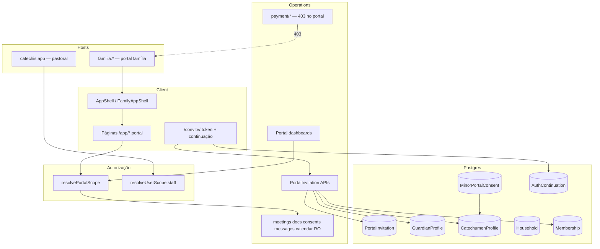
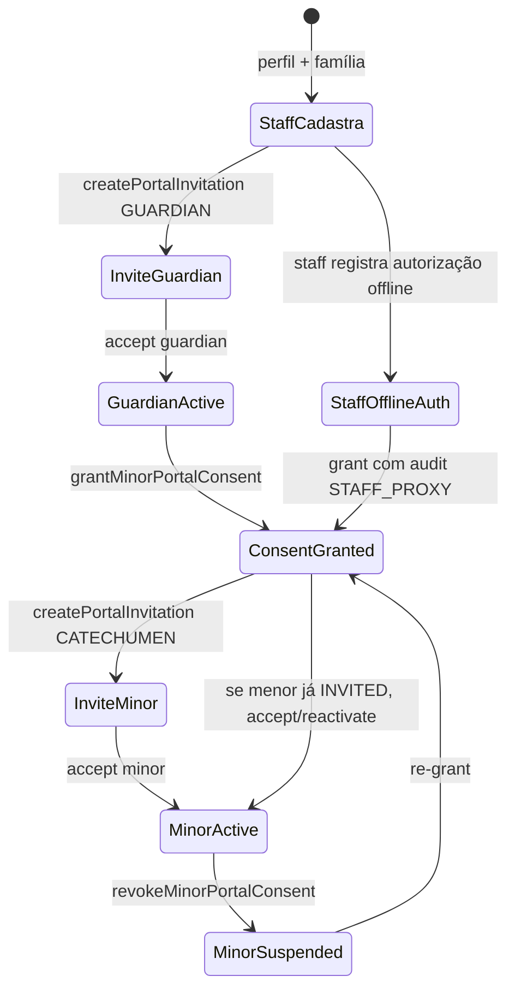

# Design Doc: Portal da Família e do Catequizando 100% funcional

| Campo | Valor |
|-------|--------|
| **Título** | Portal da Família e do Catequizando — produto patrocinado, seguro e completo |
| **Autor** | Engineering / Product (Catequese Viva) |
| **Data** | 2026-07-15 |
| **Status** | Draft (rev. 3 — pós re-review) |
| **Escopo de código** | `app/` (Wasp), especialmente `schema.prisma`, `main.wasp`, `src/server/operations/*`, `src/catequese/FamilyAppShell.tsx`, `src/auth/*`, `src/payment/*` |

---

## Overview

O **Portal da Família** (host `familia.catechis.app` / `FAMILY_PORTAL_HOST`, ver `src/shared/portal.ts`) precisa ser um **produto patrocinado pela paróquia**, com jornada, permissões e métricas próprias — não uma versão reduzida do painel pastoral (`catechis.app`).

Hoje o sistema reutiliza o fluxo genérico de membros (`PendingInvitation` + `Membership` INVITED, `inviteUserToParish` / `acceptInvitation*` em `memberOperations.ts`), aplica trial comercial no `onAfterSignup` (`src/auth/hooks.ts`), resolve vínculos de perfil por e-mail (e até cria `CatechumenProfile` com `firstName` = parte local do e-mail), auto-aceita convites no `AppShell`, e ainda tem APIs onde qualquer membership ACTIVE enxerga lista de membros da paróquia ou cria eventos litúrgicos. O shell familiar (`FamilyAppShell.tsx`) e rotas `/app/*` existem parcialmente, mas a jornada dashboard → dependente → encontro → documentos → consentimentos não está fechada, e `getGuardianDashboard` está **comentado** em `main.wasp`.

Este design propõe: (P0) **escopo de portal centralizado + hardening de autorização e billing**; (P1) **`PortalInvitation` + consentimento de menor**; (P2) **experiência completa do portal** com DTOs mínimos, observabilidade e testes de aceite.

---

## Background & Motivation

### Estado atual (código)

| Área | Implementação atual | Problema |
|------|---------------------|----------|
| Modelo de convite | `PendingInvitation` (`schema.prisma` ~439–461): `email`, `token` em claro, `parishId`, `communityId?`, `role`, `invitedById?`, unique `(email, parishId)` | Sem `householdId`, sem `guardianProfileId` / `catechumenProfileId`, sem status ACCEPTED/REVOKED, sem contagem de reenvio |
| Aceite | `acceptInvitation`, `acceptInvitationByToken`, `linkProfile` em `memberOperations.ts` | Vínculo por `email`; fallback cria `GuardianProfile` genérico; `CatechumenProfile.updateMany` por e-mail (pode amarrar vários) |
| Pré-criação no invite | `inviteUserToParish` com `householdId` opcional | Sem household: zero perfil; com household + CATECHUMEN: `firstName: args.email.split('@')[0]` |
| Persistência de token | `src/auth/inviteTokenStorage.ts` → `sessionStorage` | Perde em verificação de e-mail, OAuth, outro browser/subdomínio |
| Auto-aceite | `AppShell.tsx` (~85–111): se role família e memberships `INVITED`, chama `acceptInvitation` em massa | Aceite sem confirmação explícita |
| Signup comercial | `onAfterSignup`: `subscriptionStatus: 'trialing'`, `subscriptionPlan: PRODUCT_TRIAL_PLAN_ID` + Meta CAPI CompleteRegistration | Familiar/catequizando entram como trial/lead comercial |
| Escopo genérico | `resolveUserScope` (`sharedScope.ts`): parishIds + roles ACTIVE | Não distingue portal vs pastoral; não retorna família/dependentes/capacidades |
| Guardian identity | `GuardianProfile.userId String? @unique` | Um User → no máximo **um** guardian profile global; multi-família/paróquia quebra |
| Membros | `listParishMembers`: qualquer ACTIVE na paróquia (ou owner PERSONAL) | GUARDIAN/CATECHUMEN listam membros |
| Calendário | `createLiturgicalEvent` / `deleteLiturgicalEvent`: qualquer ACTIVE; create usa **primeiro** membership ACTIVE | Família escreve; multi-membership grava na paróquia errada |
| Contatos | `listAllowedConversationContactsInternal`: path não-catequizando lista memberships + guardians + catechumens da paróquia | GUARDIAN com escopo excessivo |
| Dashboard | `getDashboardStats` + `resolveMeetingClassScope` (mitigação parcial); `getGuardianDashboard` comentado | UI pastoral reutilizada; jornada incompleta |
| Consentimentos | `ConsentRecord` + `ConsentType` por **household** | Sem consentimento de acesso ao portal do menor |
| E-mail verificado | Aceite só compara `email` case-insensitive; mobile checa `providerData.isEmailVerified` em `mobile.ts` | Aceite web não exige verificação Wasp Auth |
| Shell família | `FamilyAppShell` allowlist curta; bottom nav Início/Agenda/Mensagens | Falta “Mais”, conta, jornada, dependentes, consents |
| Testes | `family-portal.test.ts` majoritariamente `itOrSkip` se `NODE_ENV !== 'development'` | CI não garante matriz de authz |

### Motivação de produto

- Paróquia **patrocina** o acesso da família; conversão Stripe/trial é do workspace pastoral, não do responsável.
- LGPD / pastoral: menores e dados sensíveis exigem **autorização explícita** e **mínimo privilégio**.
- E-mail compartilhado **não adivinha** vínculos; cada login de catequizando exige identidade própria (ver política de identidade).

---

## Goals & Non-Goals

### Goals

1. **Autorização server-side** unificada via `resolvePortalScope` em todas as leituras/escritas do portal.
2. **Zero billing comercial** para papéis GUARDIAN/CATECHUMEN no portal (UI + server + analytics).
3. **Convites de portal** com destino de perfil **exato**, token hasheado, lifecycle, continuação server-side pós-auth.
4. **Consentimento de menor** obrigatório para concluir acesso de &lt;18 (ou `birthDate` ausente), **sem chicken-egg** (guardian e/ou staff autorizam antes do ACTIVE do menor).
5. **Jornada UX completa** mobile-first no `FamilyAppShell`, páginas próprias.
6. **Acesso essencial patrocinado** se `TenantBilling` inativo — allowlist explícita de operations (abaixo); corte só por revogação de vínculo/membership/consent.
7. **Testes de segurança no mesmo PR** que cada mudança de authz/billing/convite; e2e cross-feature depois.

### Non-Goals

- Reescrever convites administrativos staff em `PendingInvitation`.
- Novo processador de pagamento / mudança de planos Stripe.
- App nativo.
- Redesign pastoral completo (exceto convites contextuais + central + switch misto).
- Chat real-time novo.
- **Uma conta User com vários logins de catequizando distintos sob o mesmo e-mail** (política: 1 e-mail = 1 pessoa; ver Identidade).

---

## Política de identidade (decisão de produto)

Estas regras fecham Issues de multi-perfil e e-mail compartilhado.

| Cenário | Política |
|---------|----------|
| Responsável em **várias famílias/paróquias** | **Permitido** após migração de schema: múltiplos `GuardianProfile` por `userId` com `@@unique([userId, householdId])` |
| Catequizando com login próprio | **Um** `CatechumenProfile.userId` por User (manter 0..1 vínculo efetivo: se `userId` já set, só re-aceite idempotente do **mesmo** perfil) |
| E-mail do pai em convites de **dois filhos** como CATECHUMEN | **Não suportado** no mesmo User: convite de catequizando exige e-mail **próprio** do menor (ou do adolescente) **ou** o menor **não tem conta** e o guardian usa o portal por ele |
| Guardian gerencia dependentes sem conta do menor | **Fluxo principal recomendado** para &lt;18: convite GUARDIAN + consentimento; convite CATECHUMEN só quando a paróquia quiser login do adolescente (≥14 opcional, ≥18 ok) |
| Papéis mistos (catequista + guardian) | Um User; **mode** PORTAL vs STAFF explícito. **Mesma paróquia:** ver modelo de membership mista (abaixo) — **não** rejeitar com `DUPLICATE_ROLE_CONFLICT` |

**Matriz de aceite com e-mail compartilhado (atualizada):**

- 1 User guardian + N dependentes **sem** conta própria → OK.  
- 1 User + 1 convite CATECHUMEN no mesmo e-mail do guardian → **bloqueado** no create (`EMAIL_ROLE_CONFLICT`) se o e-mail já tem/terá membership GUARDIAN na mesma paróquia, **ou** exige e-mails distintos.  
- 2 convites CATECHUMEN com o **mesmo** e-mail → segundo create falha se já existe PENDING/ACCEPTED para outro `catechumenProfileId` com esse e-mail; staff deve corrigir e-mails.

### Modelo de membership mista (mesma paróquia) — decisão

O schema atual tem **uma** coluna `Membership.role` e **não** há `@@unique([userId, parishId])` (só índice). Casos pastorais reais: a mesma pessoa é `LEAD_CATECHIST` **e** responsável de família na **mesma** paróquia. O `AppShell` já detecta staff vs família via `allMemberships` / roles.

**Decisão (opção 1 do review): permitir duas (ou mais) rows `Membership` por `(userId, parishId)` com roles diferentes.**

| Regra | Detalhe |
|-------|---------|
| Uniqueness | Adicionar `@@unique([userId, parishId, role])` na migração P1 (PR4). **Não** unique só em `(userId, parishId)`. |
| Aceite GUARDIAN | Se já existe membership staff ACTIVE na paróquia → **criar** membership GUARDIAN ACTIVE adicional (ou ativar INVITED GUARDIAN); **nunca** sobrescrever role staff. |
| Aceite CATECHUMEN | Idem: não rebaixar staff; se já for GUARDIAN na mesma paróquia com mesmo e-mail, create de convite CATECHUMEN já é bloqueado por política de identidade. |
| `resolveUserScope` / staff | Agrega **todas** as memberships ACTIVE; `roles[]` pode conter `LEAD_CATECHIST` e `GUARDIAN`. |
| `resolvePortalScope` | Com `surface=PORTAL`, escolhe a membership (ou role) GUARDIAN/CATECHUMEN da paróquia ativa + perfil; capabilities só de portal. Com `surface=STAFF`, ignora capabilities de família. |
| `listParishMembers` / UI staff | Pode listar múltiplas rows do mesmo user (uma por role) ou colapsar na UI com badge multi-role — implementação: listar rows; client pode agrupar. |
| Código legado que faz `findFirst({ userId, parishId })` | Deve preferir role staff para ops pastorais e role família para portal, ou `findMany` — auditar em PR4 junto com `findUnique` de guardian. |

**Rejeitado:** (2) portal só via `GuardianProfile` sem membership GUARDIAN — quebra premissas de membership ACTIVE e billing/scope existentes.  
**Rejeitado:** (3) secondary role flag — maior churn no schema de Membership usado em todo o app.

---

## Proposed Design

### Arquitetura lógica



### P0 — `resolvePortalScope` e hardening

#### Interface

Novo módulo: `src/server/operations/portalScope.ts` (padrão `sharedScope.ts` + asserts de `auth/helpers.ts`).

```typescript
export type PortalCapability =
  | 'READ_DEPENDENT'
  | 'READ_OWN_PROFILE'
  | 'JUSTIFY_ABSENCE'
  | 'UPLOAD_DOCUMENT'
  | 'MANAGE_CONSENT'
  | 'MESSAGE_CLASS_STAFF'
  | 'MESSAGE_HOUSEHOLD'
  | 'READ_MEETING'
  | 'READ_CALENDAR'
  | 'ADMIN_CALENDAR'      // nunca no portal puro
  | 'LIST_PARISH_MEMBERS' // nunca no portal puro
  | 'BILLING';            // nunca no portal puro

/** Interno no servidor: Set ok. Qualquer DTO client-facing: PortalCapability[] */
export type PortalScope = {
  mode: 'PORTAL' | 'STAFF' | 'MIXED_NEEDS_CHOICE';
  workspaceId: string | null;       // parishId ativo
  householdId: string | null;       // household ativo (guardian multi-família)
  membershipId: string | null;
  role: 'GUARDIAN' | 'CATECHUMEN' | null;
  guardianProfileId: string | null;
  catechumenProfileId: string | null;
  dependentCatechumenIds: string[];
  allowedClassIds: string[];
  capabilities: PortalCapability[]; // sempre array em estruturas serializáveis
  minorPortalAccessBlocked: boolean;
  parishSponsoredEssential: boolean; // true: ops essenciais ignoram TenantBilling inativo
};

export async function resolvePortalScope(
  context: any,
  opts?: {
    parishId?: string;
    householdId?: string;
    preferRole?: 'GUARDIAN' | 'CATECHUMEN';
    /** Se omitido e user tem staff+família: retorna MIXED_NEEDS_CHOICE */
    surface?: 'PORTAL' | 'STAFF';
  }
): Promise<PortalScope>;
```

**Preferência de workspace / mode (contrato client):**

| Mecanismo | Nome | Notas |
|-----------|------|--------|
| Cookie httpOnly | `cv_workspace` | `{ parishId, householdId?, surface: 'PORTAL'\|'STAFF' }`, Path=`/`, SameSite=Lax, Secure em prod; **sem** Domain pai (host-scoped) |
| Fallback | membership switching existente / `useUserContext` | Alinhar escrita do cookie ao seletor de workspace |
| Host família (`isFamilyPortalHost`) | força `surface: 'PORTAL'` se houver role família; se só staff, redirect staff portal |
| Host staff | default `STAFF`; se só família, redirect `familyPortalUrl` (já em `AppShell`) |
| `MIXED_NEEDS_CHOICE` | HTTP **409** com body `{ code: 'MIXED_NEEDS_CHOICE', options: [...] }` se operation portal/staff chamada sem `surface` resolvível | Client mostra seletor e re-chama |

**Regras de resolução**

1. Memberships ACTIVE com role GUARDIAN ou CATECHUMEN no `parishId` ativo (pode coexistir com outra membership staff na **mesma** paróquia — ver modelo misto).  
2. Perfil **exato** no workspace:  
   - GUARDIAN: `GuardianProfile` onde `userId = user.id` **e** `householdId` = household ativo (**não-nulo**). **Não** usar `findUnique({ userId })` global após migração multi-household.  
   - CATECHUMEN: `CatechumenProfile` onde `userId = user.id` e `parishId` coerente.  
3. Dependentes = catequizandos do `householdId` do guardian ativo.  
4. `allowedClassIds` = enrollments ENROLLED (mesma lógica de `resolveMeetingClassScope`).  
5. Capabilities derivadas do role + mode; portal puro **nunca** inclui `ADMIN_CALENDAR`, `LIST_PARISH_MEMBERS`, `BILLING`.  
6. **Esconder botão ≠ ACL.**

#### Migração `GuardianProfile.userId` (obrigatória no P1 schema, planejada com portal)

**Decisão:** permitir múltiplos guardians por User.

```prisma
model GuardianProfile {
  // ...
  userId String?  // REMOVER @unique
  user   User?    @relation(...)
  // ...
  // App-level: userId só pode ser setado se householdId != null
  @@unique([userId, householdId])
  @@index([userId])
  @@index([householdId])
}
```

**Invariantes de dados (obrigatórios na migração + accept):**

1. **Proibido** `userId != null && householdId == null`. Aceite GUARDIAN e qualquer link de perfil **falham** com `HOUSEHOLD_REQUIRED` se o `GuardianProfile` não tiver household — staff deve anexar família antes.  
2. Script de migrate: listar `GuardianProfile` com `userId` set e `householdId` null → fila de revisão / backfill; **não** setar `userId` em novos links sem household.  
3. Em Postgres, `UNIQUE (userId, householdId)` permite múltiplas rows com `userId=NULL` (NULL distinto) — OK para perfis ainda não vinculados. Rows com mesmo `userId` e `householdId=NULL` **não** devem existir porque o app **recusa** o link.  
4. Opcional raw SQL: `CHECK (userId IS NULL OR householdId IS NOT NULL)`.

- Atualizar **todas** as queries `findUnique({ where: { userId } })` (ex.: `guardianOperations.ts`, `assertCanAccessCatechumen` em `auth/helpers.ts`, document/meeting paths) para `findFirst` / `findMany` filtrados por household/parish do scope.  
- `User.guardianProfile` relação 1:1 no Prisma → renomear para `guardianProfiles GuardianProfile[]`.

#### Aplicação por operation (P0)

| Operation / área | Arquivo | Correção |
|------------------|---------|----------|
| `listParishMembers` | `memberOperations.ts` | Ver matriz de papéis abaixo |
| `createLiturgicalEvent` / `deleteLiturgicalEvent` | `calendarOperations.ts` | `parishId` **obrigatório** no args; `assertCanWriteCalendar(context, parishId)` = admin \| PERSONAL_OWNER daquele parish \| membership ACTIVE com role em `COORDINATOR_OR_ABOVE` (`PARISH_COORDINATOR`, `COMMUNITY_COORDINATOR`, `DIOCESE_ADMIN`, `SUPER_ADMIN`, `PERSONAL_OWNER`). **Catequistas e família: 403** |
| Contatos + envio | `conversationOperations.ts` | Branch GUARDIAN completa + `assertParticipantIdsAllowed` já usa contatos — **fechar allowlist em PR1** |
| Presença completa | `meetingOperations.ts` | Staff-only para roster/matrix/sheet; portal DTO sem lista completa |
| Dashboard | portal dashboards | Não usar stats pastorais |
| Justificativa / docs | justify*, document* | `assertDependentInScope` |
| Billing | `payment/operations.ts` | 403 + redirect |

#### Matriz exata: `listParishMembers`

| Quem | Acesso |
|------|--------|
| `context.user.isAdmin` | Sim, paróquia pedida |
| `PERSONAL_OWNER` do `parishId` (`Parish.ownerId` + type PERSONAL) | Sim |
| Membership ACTIVE com role `SUPER_ADMIN`, `DIOCESE_ADMIN`, `PARISH_COORDINATOR`, `COMMUNITY_COORDINATOR` | Sim (diocese: parish no escopo diocesano via `getDioceseParishIds`) |
| `LEAD_CATECHIST` / `ASSISTANT_CATECHIST` | **Não** lista paroquial completa (403). Usar roster de turma (`getMeetingAttendanceSheet` / class ops) |
| `GUARDIAN` / `CATECHUMEN` / `PASTORAL_VIEWER` / `CONTENT_REVIEWER` | **403** |

Helpers: reutilizar `isCoordinatorOrAbove` de `sharedScope.ts` + check PERSONAL_OWNER; **não** unir catequistas.

#### Allowlist: acesso essencial vs billing pastoral

Portal ops **não** chamam `assertCanCreateClass` / `assertCanEnrollCatechumen` / AI credit gates de `billingEnforcement.ts`. Addendum a `docs/billing-rules.md`: *family portal essential access is not personal entitlement nor institutional paid feature — membership + consent only*.

**`portalEssentialOperations` (ignoram `TenantBilling` inativo / trial paroquial expirado):**

| Operation | Notas |
|-----------|--------|
| `getGuardianPortalDashboard` / `getCatechumenPortalDashboard` | |
| `getPortalInvitation` / `acceptPortalInvitation` / list próprios convites pendentes | |
| `getMeeting` / list meetings no `allowedClassIds` (RO) | sem roster admin |
| `listLiturgicalEvents` filtrado (RO) | |
| `justifyAbsence` / `justifyAbsenceByMeeting` | só dependentes/self |
| Document list/upload/download próprios dependentes ou self | |
| `grantMinorPortalConsent` / `revokeMinorPortalConsent` / list consents | |
| Conversation list/send com contatos allowlist | |
| `getCurrentUserContext` / account profile sem billing | |
| `resolvePortalScope` consumers acima | |

**`pastoralBillingGated` (continuam enforcement atual):**

| Operation | Módulo |
|-----------|--------|
| `createClass`, enroll, parish create | `billingEnforcement.ts` |
| AI chat/credits | `ai/credits.ts` |
| Checkout, customer portal Stripe | `payment/operations.ts` |
| Admin pastoral reports, member role updates, invite staff | staff only |

`parishSponsoredEssential: true` no scope quando role é GUARDIAN/CATECHUMEN ACTIVE (mesmo se `resolveEffectiveBilling` = free/canceled).

#### Billing / assinatura (P0) e detecção de signup portal

**Princípio:** familiar e catequizando **nunca** são donos de assinatura comercial no portal.

**Detecção em `onAfterSignup` (ordem obrigatória):**

```text
1. Normalize email
2. isPortalSignupCandidate =
     (a) exists PendingInvitation where email + role in (GUARDIAN, CATECHUMEN)
  OR (b) exists PortalInvitation PENDING for emailNormalized (após PR4)
  OR (c) AuthContinuation / signed signup state kind=PORTAL_INVITE (cookie ou query state criado no /convite)
3. IF isPortalSignupCandidate:
     - NÃO setar subscriptionStatus trialing / PRODUCT_TRIAL_PLAN_ID
     - setar User.accountOrigin = 'PORTAL' se coluna existir (PR3 slice)
     - NÃO enviar Meta CompleteRegistration content_category=subscription
     - opcional: TrackedEvent portal_registration
   ELSE:
     - trial comercial atual
     - Meta CompleteRegistration atual
4. Converter pending staff/family memberships INVITED como hoje (sem auto-ACTIVE)
```

**Healing (idempotente, job ou no accept):**

- Se User tem `accountOrigin=PORTAL` **ou** only family memberships ACTIVE/INVITED e `subscriptionStatus=trialing` sem `paymentProcessorUserId`: limpar trial → `subscriptionStatus=null`, plan `catechist_free` (ou null), sem reverter se já pagou Stripe.

**PR3** implementa (a)+(c)+healing **sem** esperar schema completo de convite; (b) liga em PR4.

**Server 403:** `generateCheckoutSession`, `getCustomerPortalUrl`, compra créditos AI se `accountOrigin=PORTAL` **ou** só roles família **ou** `surface=PORTAL`.

**Client:** host família / family-only → `/app/billing` → `/app`; sem UI de preços.

---

### P1 — `PortalInvitation`

#### Modelo Prisma

```prisma
enum PortalInviteRole {
  GUARDIAN
  CATECHUMEN
}

enum PortalInviteStatus {
  PENDING
  ACCEPTED
  EXPIRED
  REVOKED
}

model PortalInvitation {
  id        String   @id @default(uuid())
  createdAt DateTime @default(now())
  updatedAt DateTime @updatedAt

  parishId    String
  parish      Parish @relation(...)
  communityId String?
  community   Community? @relation(...)

  // Opcional: obrigatório para GUARDIAN; para CATECHUMEN derivado do perfil se existir
  householdId String?
  household   Household? @relation(...)

  role PortalInviteRole

  guardianProfileId   String?
  guardianProfile     GuardianProfile? @relation(...)
  catechumenProfileId String?
  catechumenProfile   CatechumenProfile? @relation(...)

  emailNormalized String
  tokenHash       String   @unique
  // plaintext token NUNCA em DB; só no e-mail/WhatsApp no momento do envio

  status PortalInviteStatus @default(PENDING)

  invitedById   String?
  expiresAt     DateTime
  acceptedAt    DateTime?
  acceptedById  String?
  lastSentAt    DateTime?
  resendCount   Int @default(0)

  shortCodeHash String? @unique

  @@index([emailNormalized, status])
  @@index([parishId, status])
  @@index([householdId, status])
  @@index([guardianProfileId])
  @@index([catechumenProfileId])
  @@index([expiresAt])
}
```

**Invariantes no create:**

- GUARDIAN → `guardianProfileId` obrigatório; `householdId` **obrigatório** (do perfil); `catechumenProfileId` null.  
- CATECHUMEN → `catechumenProfileId` obrigatório; `householdId` = perfil.householdId se houver, senão null; se null, staff UI **recomenda** criar household antes, mas create **não bloqueia** (guardian scope usará parish + profile).  
- Perfil deve existir e pertencer à `parishId`.  
- Não inventar nome a partir do e-mail.  
- Revogar PENDING anterior do mesmo profile destino ao recriar.  
- E-mail do convite CATECHUMEN ≠ e-mail de guardian ACTIVE na mesma paróquia com conflito de identidade (política acima).

#### Continuação server-side (decisão fechada)

**Decisão (A5):** **não** usar cookie de parent domain entre `familia.*` e `catechis.app`. Em vez disso:

1. **`AuthContinuation` row** (opaque id) + cookie **host-scoped** no host onde o user abriu o convite.  
2. **Deep-link de retorno** após auth no host canônico de família (`FAMILY_PORTAL_HOST` / `REACT_APP_FAMILY_PORTAL_HOST` — **nunca** hardcode só prod; homolog usa `familia-…` via env, ver `isFamilyPortalHost` em `shared/portal.ts`):  
   - `https://{FAMILY_PORTAL_HOST}/convite/continuar?cid={continuationId}&sig={hmac}`  
   - `sig` = HMAC-SHA256(`continuationId|exp`, `AUTH_CONTINUATION_SECRET`), exp = now+15min; row TTL **24h**.  
3. Wasp hoje: `onAuthSucceededRedirectTo: "/app"` e `emailVerification.clientRoute: EmailVerificationRoute` são **paths relativos ao host que serviu o auth** (`main.wasp`) — não dual-host. Continuação **não** depende de reconfigurar OAuth redirect URIs além do necessário; depende de **client hooks** pós-auth.

**Entry points client a patchar (PR5) — lista fechada:**

| Entrypoint | Arquivo | Comportamento |
|------------|---------|----------------|
| Landing convite | `InviteAcceptPage.tsx`, `FamilyInviteCodePage.tsx` | Cria/atualiza `AuthContinuation` + set `cv_continue` |
| Pós-signup | `CustomSignupForm.tsx`, `FamilySignupPage.tsx`, `SignupPage.tsx` | Após sucesso, se continuation → `redirectToFamilyContinuation()` |
| Pós-login | `LoginPage.tsx`, `FamilyLoginPage.tsx`, `CustomLoginForm.tsx` | Idem |
| Verificação e-mail | `EmailVerificationPage.tsx` (hoje só `VerifyEmailForm` + link login) | Após verify (poll auth ou link “continuar”), se `cv_continue` **ou** query server `hasPortalContinuation(email)` → 302 absolute para family deep-link |
| OAuth return | Fluxo Google termina em `onAuthSucceededRedirectTo: /app` no **mesmo host** | Em `AppShell` / `useRedirectIfLoggedIn` / thin wrapper no primeiro paint de `/app`: se user tem continuation pendente (cookie ou server query por e-mail) **e** host ≠ family → `window.location` = family deep-link; se já no family host → `/convite/continuar?...` ou reabrir aceite |
| Family continuar | nova rota `/convite/continuar` | Valida HMAC, rehidrata UI de aceite **sem** auto-accept |

Helper client compartilhado: `src/auth/portalContinuation.ts` — `redirectToFamilyContinuation()`, `buildFamilyContinuationUrl(cid)`, lê env `REACT_APP_FAMILY_PORTAL_HOST`.

```prisma
model AuthContinuation {
  id              String   @id @default(uuid())
  createdAt       DateTime @default(now())
  expiresAt       DateTime
  kind            String   // PORTAL_INVITE
  portalInvitationId String
  tokenHash       String   // challenge: prova que viu o token original
  consumedAt      DateTime? // set no accept bem-sucedido
  userId          String?
  createdFromHost String?  // audit
}
```

| Propriedade | Valor |
|-------------|--------|
| Cookie nome | `cv_continue` = `continuationId` apenas |
| Cookie flags | HttpOnly, Secure (prod), SameSite=Lax, Path=/, **sem Domain** (host-only) |
| TTL row | 24h |
| Uso | multi-read até `accept` sucesso → `consumedAt`; depois 410 |
| CSRF accept | action autenticada Wasp (cookie de sessão) + mesma origem; não aceitar só com `cid` sem sessão |
| sessionStorage | legado 1 release; não fonte de verdade |

#### E-mail verificado (mapeamento Wasp Auth)

Novo helper `src/server/auth/emailVerification.ts` — **incluir na PR4** junto com `acceptPortalInvitation` (não adiar para PR5).

Imports alinhados ao código real (`src/server/api/mobile.ts`, `userOperations.ts`):

```typescript
import {
  createProviderId,
  findAuthIdentity,
  getProviderDataWithPassword,
} from 'wasp/auth/utils'; // NÃO wasp/server/auth

/**
 * Email provider: createProviderId('email', email) → findAuthIdentity → isEmailVerified.
 * If no email identity but Google (or other OAuth) identity exists for the user, treat as verified.
 * SKIP_EMAIL_VERIFICATION_IN_DEV=true && NODE_ENV !== 'production' → allow.
 */
export async function assertEmailVerifiedForPortalAccept(user: {
  id: string;
  email?: string | null;
}): Promise<void>
```

**Passos de lookup (ordem):**

1. Dev bypass: `SKIP_EMAIL_VERIFICATION_IN_DEV === 'true'` e não production → return.  
2. Se `!user.email` → `EMAIL_NOT_VERIFIED` (portal exige e-mail).  
3. `providerId = createProviderId('email', normalizeEmail(user.email))`.  
4. `identity = await findAuthIdentity(providerId)`.  
5. Se identity: `getProviderDataWithPassword<'email'>(identity.providerData)`; se `isEmailVerified` → OK; senão `EMAIL_NOT_VERIFIED`.  
6. Se **não** há identity email: verificar se o user tem auth OAuth. Padrão in-repo não lista identities por `userId` via um único helper exportado — opções aceitas na implementação:  
   - (preferida) query Prisma/`context.entities` nas tabelas Auth internas **somente se** o projeto já expõe isso em outro módulo; **ou**  
   - chamar `findAuthIdentity(createProviderId('google', /* providerUserId */))` se o Google `providerUserId` estiver disponível no user; **ou**  
   - se o signup foi Google e `user.email` está preenchido pelo `getGoogleUserFields` e não há row email, **tratar OAuth-only como verificado** quando `Auth` do user não tem provider email (implementar com o mesmo padrão que o Open SaaS usa para “has social login” no projeto — auditar `userOperations.ts` / wasp auth tables no PR4 e cobrir com **unit test mockando** `findAuthIdentity`).  
7. Teste unitário obrigatório: mock identity email verified/unverified; mock ausência email + OAuth path.

Comparar ainda `normalizeEmail(user.email) === invitation.emailNormalized`.

#### APIs

| API | Auth | Descrição |
|-----|------|-----------|
| `createPortalInvitation` | staff (coord+ / lead que já pode convidar família hoje) | PENDING + e-mail + `whatsappUrl`; **não** retorna raw token no body de listagens posteriores |
| `listPortalInvitations` | staff | Sem token/hash |
| `getPortalInvitation` | público rate-limited | DTO **sem** `token`, **sem** e-mail completo (só mask), com `invitationId`, role, parishName, profileDisplayName, expiresAt, hasAccount, requiresMinorConsent |
| `acceptPortalInvitation` | auth + e-mail verificado | Ver algoritmo |
| `resend` / `revoke` | staff | |
| `grantMinorPortalConsent` / `revokeMinorPortalConsent` | guardian (mesmo household) ou staff coord+ | |
| dashboards | portal | |

**DTO `getPortalInvitation` — proibido:** `token`, `tokenHash`, e-mail plaintext, `inviteEmail` completo (legado retorna isso — **remover** no dual-read).

**Rate limit** (reutilizar padrão `memberOperations.ts`):

- `RATE_LIMIT_MAX = 10` / `RATE_LIMIT_WINDOW = 60_000` por IP em get.  
- Accept autenticado: 20/min por userId.  
- Sem captcha na v1; 429 com mensagem genérica (não revelar se token existe além do 404 já usado).

**Dual-read legado (PR8):** ao receber token plaintext legado, `sha256(token)` compare se migrado; senão lookup `PendingInvitation.token` **em memória**, nunca logar token; response DTO alinhado (sem ecoar token).

#### Algoritmo de aceite (transação)

Isolation: `prisma.$transaction` interativa; lock da invitation com `updateMany` where `id`+`status=PENDING` (count=0 → conflito).

```text
acceptPortalInvitation({ invitationId?, token? }):
  requireAuth
  assertEmailVerifiedForPortalAccept(user)  // helper shipped in PR4

  BEGIN
    inv = load PortalInvitation FOR UPDATE by id or tokenHash(sha256(token))
    if !inv → 404
    if inv.status == ACCEPTED && inv.acceptedById == user.id → return idempotent success DTO
    if inv.status == ACCEPTED → ALREADY_USED
    if inv.status == REVOKED → REVOKED
    if inv.expiresAt < now → set EXPIRED; EXPIRED
    if inv.status != PENDING → ALREADY_USED
    if normalize(user.email) != inv.emailNormalized → EMAIL_MISMATCH

    profile = load target profile FOR UPDATE
    if inv.role == GUARDIAN && profile.householdId == null → HOUSEHOLD_REQUIRED
    if profile.userId != null && profile.userId != user.id → PROFILE_ALREADY_LINKED

    // ── Branch menor sem consent (única política — opção A) ─────────────
    if inv.role == CATECHUMEN && isMinor(profile) && !hasActiveMinorPortalConsent(profile.id):
      // NÃO cria Membership. NÃO linka profile.userId. NÃO muda inv.status.
      // Invite permanece PENDING (resend/dual-read/get continuam válidos).
      // UI: “Aguardando autorização do responsável” via getPortalInvitation.requiresMinorConsent
      //    + dashboard guardian lista convites PENDING dos dependentes (por catechumenProfileId).
      ROLLBACK  // ou COMMIT sem writes — preferir zero writes
      → 403 MINOR_CONSENT_REQUIRED {
          code, catechumenProfileId, guardiansHint: masked names of household guardians
        }

    // Link profile (só após passar consent gate)
    if profile.userId is null:
      try set profile.userId = user.id
      catch unique violation → PROFILE_ALREADY_LINKED

    // Membership: unique (userId, parishId, role) — NÃO (userId, parishId) sozinho
    m = find Membership (userId, parishId, role=inv.role)
    if m?.status == ACTIVE → ok (idempotent)
    if m?.status == SUSPENDED → set ACTIVE (re-consent / re-accept path)
    if m?.status == INVITED → set ACTIVE
    if !m → create Membership ACTIVE with role=inv.role
    // Outras memberships ACTIVE na mesma parish com OUTRO role (ex. LEAD_CATECHIST):
    //   intocadas — mixed same-parish OK

    inv.status = ACCEPTED; acceptedAt=now; acceptedById=user.id
    AuthContinuation.consumedAt = now if any
  COMMIT

  audit MEMBER_ACCEPT_PORTAL
  return DTO
```

**Estado canônico “menor aguardando consent” (opção A — fechada):**

| Entidade | Estado |
|-----------|--------|
| `PortalInvitation` | `PENDING` (até grant + accept sucesso) |
| `Membership` role CATECHUMEN | **ausente** (não criar INVITED neste branch) |
| `CatechumenProfile.userId` | **null** (ainda não linkado) |
| UI guardian | query `listPortalInvitations` / dependentes com invite PENDING + `requiresMinorConsent` |
| UI menor autenticado | `getPortalInvitation` ou `getMyPendingPortalInvites` → banner aguardando |

**Por que não INVITED membership (opção B):** evita membership órfã, auto-accept legado no `AppShell` sobre INVITED, e dual-read confuso; o convite PENDING já é a fonte de verdade.

**Matriz de conflito**

| Situação | Código |
|----------|--------|
| Dois users aceitam o mesmo PENDING (corrida) | Segundo: `ALREADY_USED` |
| Profile já de outro user | `PROFILE_ALREADY_LINKED` |
| Guardian profile sem household | `HOUSEHOLD_REQUIRED` |
| E-mail sessão ≠ convite | `EMAIL_MISMATCH` |
| E-mail não verificado | `EMAIL_NOT_VERIFIED` |
| Menor sem consent | `MINOR_CONSENT_REQUIRED` (zero writes; invite PENDING) |
| Já existe staff membership mesma parish | **OK** — cria membership GUARDIAN/CATECHUMEN paralela |
| Re-aceite mesmo user | 200 idempotente |
| SUSPENDED por revoke; re-grant | `grantMinorPortalConsent` reativa membership se profile já linkado; senão menor chama accept de novo |

**Reviver SUSPENDED:** `grantMinorPortalConsent` se `userId` no profile e membership CATECHUMEN `SUSPENDED` → reativa `ACTIVE` **sem** novo convite.

#### Fluxo consentimento menor (sem chicken-egg)



**Regras:**

1. **Ordem recomendada de produto:** convite/aceite do **guardian** → grant em `/app/consents` (ou interstitial “autorizar acesso do dependente X”) → só então convite/aceite do menor.  
2. Staff UI de “Convidar catequizando menor” **bloqueia envio** se não houver consent vigente **ou** exige checkbox “já tenho autorização assinada offline” que chama `grantMinorPortalConsent` com `source=STAFF_OFFLINE` + `AuditLog` — **somente após schema/API de consent (PR6 reordenado; ver PR Plan)**.  
3. Se o menor clica o link **antes** do grant: signup/login OK; accept retorna `MINOR_CONSENT_REQUIRED` com **zero writes** (opção A); UI “Aguardando autorização do responsável”.  
4. Guardians da mesma família **já no portal** veem pendência “autorizar [nome]” no dashboard (invites PENDING dos dependentes).  
5. `birthDate == null` ⇒ tratado como menor até staff preencher data.

---

### P1 — Consentimento de menor (modelo corrigido)

**Decisão (A6):** modelo **dedicado** `MinorPortalConsent` (não reutilizar `ConsentRecord` + novo `ConsentType`) — lifecycle de acesso de conta ≠ consentimentos pastorais de imagem/comunicação; evita unique `(householdId, type)` inadequado.

```prisma
model MinorPortalConsent {
  id        String   @id @default(uuid())
  createdAt DateTime @default(now())

  catechumenProfileId String
  catechumenProfile   CatechumenProfile @relation(...)
  grantedByGuardianId String?  // null se STAFF_OFFLINE
  grantedByGuardian   GuardianProfile? @relation(...)
  grantedByUserId     String?  // staff user se proxy

  policyVersion String
  source        String   // GUARDIAN_PORTAL | STAFF_OFFLINE
  grantedAt     DateTime @default(now())
  revokedAt     DateTime?
  revokeReason  String?

  @@index([catechumenProfileId, grantedAt])
  @@index([catechumenProfileId, revokedAt])
}
```

**“Vigente”:** existe row com `catechumenProfileId=X` e `revokedAt IS NULL` e `policyVersion` ∈ versões aceitas (config `PORTAL_CONSENT_POLICY_VERSION`).

**Re-grant:** append nova row; ao revoke, set `revokedAt` na row vigente (nunca unique em status).

**Postgres (opcional migrate raw):**  
`CREATE UNIQUE INDEX minor_portal_consent_one_open ON "MinorPortalConsent" ("catechumenProfileId") WHERE "revokedAt" IS NULL;`

Grant/revoke em transaction com essa constraint.

---

### P2 — Experiência completa do portal

#### Rotas

| Rota | Página | Dados |
|------|--------|--------|
| `/app` | Dashboard papel-aware | portal dashboards |
| `/app/dependents/:id` | Ficha dependente (não admin) | scope |
| `/app/meetings/:id` | Encontro + justificativa | allowedClassIds |
| `/app/my-journey` | Jornada RO | |
| `/app/documents` | Docs | |
| `/app/consents` | Família + portal menor (**mínimo na PR7**) | |
| `/app/calendar` | Agenda RO | |
| `/app/messages` | Hub contatos restritos | |
| `/app/account` | Sem billing | |

Atualizar allowlist `FamilyAppShell.tsx`.

#### Nav mobile

Início · Agenda · Mensagens · **Mais** (docs, consents/jornada, conta, saída); touch ≥44px; safe areas; loading/error/empty/offline.

#### Papéis mistos

Seletor “Área pastoral” ↔ “Portal da família” grava `cv_workspace.surface`; operations respeitam 409 MIXED.

#### Notificações (PR10)

Convite, expiração, aceite, encontro alterado/cancelado, mensagem, doc pendente, resposta justificativa, **pedido de consentimento menor**.

---

## API / Interface Changes

### Convite

**Before:** `inviteUserToParish` + `PendingInvitation.token` + eco de token no get.

**After:**

```typescript
createPortalInvitation({
  role: 'GUARDIAN' | 'CATECHUMEN',
  guardianProfileId?: string,
  catechumenProfileId?: string,
  email: string,
}): Promise<{
  id: string;
  expiresAt: string;
  invitePath: string;      // /convite/:token — token só nesta resposta one-shot ao criador staff
  whatsappUrl: string;
}>
// list/get NUNCA devolvem token de novo (resend gera novo token one-shot na resposta do resend)
```

### Calendar write

```typescript
createLiturgicalEvent({
  parishId: string; // REQUIRED
  name: string;
  date: string;
  // ...
})
// assertCanWriteCalendar(context, parishId)
```

### listParishMembers

403 salvo matriz coord+/PERSONAL_OWNER/admin (sem catequista, sem família).

---

## Data Model Changes

1. `PortalInvitation` + enums.  
2. `MinorPortalConsent` append-only + partial unique opcional.  
3. `AuthContinuation`.  
4. `GuardianProfile.userId`: drop `@unique` → `@@unique([userId, householdId])` + CHECK/assert `userId` implica `householdId`; `User.guardianProfiles[]`.  
5. `Membership`: `@@unique([userId, parishId, role])` (multi-role mesma paróquia).  
6. Opcional PR3: `User.accountOrigin String?` (`PORTAL` \| `PRODUCT`).  
7. Migração Wasp apenas (`wasp db migrate-dev`).  
8. Backfill + fila revisão convites ambíguos + guardians com userId sem household.  
9. Deprecar GUARDIAN/CATECHUMEN em `PendingInvitation` após dual-read.

---

## Alternatives Considered

### A1 — Estender `PendingInvitation`
Rejeitado: unique email+parish, token claro, sem target profile.

### A2 — Um User forçado por catequizando sem convite tipado
Rejeitado: multi-dependente / LGPD.

### A3 — ACL só no frontend
Rejeitado: APIs abertas.

### A4 — Cortar portal se billing inativo
Rejeitado: premissa de acesso essencial.

### A5 — Armazenamento de continuação auth
| Opção | Prós | Contras | Decisão |
|-------|------|---------|---------|
| Cookie Domain=.catechis.app | Sobrevive subdomínios | Amplia superfície; homolog `familia-` quebrado | Não |
| **Row AuthContinuation + deep-link HMAC ao family host** | Explícito, auditável, host allowlist | Redirect extra | **Sim** |
| JWT assinado só na query | Stateless | Leak em logs Referer; revogação difícil | Não como primário |
| Redis | Rápido | Ops extra | Não na v1 |

### A6 — Consentimento menor em `ConsentRecord` vs modelo novo
| Opção | Prós | Contras | Decisão |
|-------|------|---------|---------|
| Novo `ConsentType` em `ConsentRecord` | Menos tabelas | Unique por household+type; sem grantor; sem ledger | Não |
| **`MinorPortalConsent` dedicado** | Ledger, grantor, policy version, staff proxy | Mais schema | **Sim** |

---

## Security & Privacy

| Ameaça | Sev | Mitigação |
|--------|-----|-----------|
| Enumeração token | Alta | Hash; rate 10/min IP; DTO sem token |
| IDOR dependente | Alta | `assertDependentInScope` |
| Leak membros/contatos | Alta | Matriz list members; allowlist contatos PR1 |
| Calendário write errado | Alta | parishId explícito + role |
| Aceite sem verify | Alta | `assertEmailVerifiedForPortalAccept` |
| Auto-accept | Média | Flag + UI explícita |
| Menor sem consent | Alta | State machine + grant prévio |
| Multi-accept race | Alta | Update PENDING condicional |
| Logs com segredo | Média | Nunca logar token/e-mail completo em portal events |
| Cookie amplo | Média | Host-only + HMAC return |

---

## Observability

Contrato: **não** e-mail, token, nome completo de menor em sinks de marketing.

| Evento | Sink | Properties permitidas |
|--------|------|------------------------|
| `portal_invite_created` | `logger` info + analytics produto (não Meta ads) | invitationId, parishId, role, source |
| `portal_invite_delivered` | logger | invitationId, channel=email\|whatsapp_link |
| `portal_invite_opened` | analytics | invitationId (from get) |
| `portal_invite_accepted` | logger + analytics | invitationId, role, parishId, durationMs |
| `portal_invite_expired` / `revoked` | logger | invitationId |
| `portal_invite_fail` | logger warn | invitationId?, code=EMAIL_MISMATCH\|… |
| `portal_time_to_first_useful` | analytics | parishId, action=meeting\|doc\|message, ms |
| `portal_access_denied` | logger | capability, route/op name |
| `portal_registration` | analytics / opcional CAPI separado | userId hash, **não** subscription funnel |
| `portal_minor_consent_granted` / `revoked` | logger + audit | catechumenProfileId, source |

Retention: logs app conforme `docs/OPS.md` / política existente; analytics marketing **não** recebe convites como trial/lead.

---

## Rollout Plan

1. Flags: `PORTAL_INVITES_V2` (server), `REACT_APP_PORTAL_INVITES_V2` (client).  
2. **PR1–PR2** authz sem flag (sempre on — segurança).  
3. PR3 billing isolation + accountOrigin/healing.  
4. Schema PR4+; dual-read get/accept.  
5. **Auto-accept:** só remover quando `PORTAL_INVITES_V2` on **e** `InviteAcceptPage` cobre Membership.inviteToken legado **ou** banner “aceitar convite” no dashboard. Runbook: listar memberships INVITED família e reenviar / link `/convite`.  
6. Homolog seed com perfis explícitos.  
7. Rollback flag-off: create/accept v2 off → PendingInvitation path; colunas permanecem; **authz P0 não reverte**.  
8. Depois estável: 410 em `inviteUserToParish` para roles família.

---

## Open Questions (restantes — não bloqueantes)

1. Idade mínima opcional para convite CATECHUMEN com login (14 vs 16) — default: qualquer com consent se &lt;18.  
2. Alphabet do short code (sem 0/O) — default: Crockford base32, 8 chars.  
3. Mensagens entre catequizandos da mesma turma: **manter** allowlist atual do branch catechumen na v1 (já mais restrita que guardian dump).

~~Cookie Domain~~ → **decidido** (A5).  
~~Multi-household guardian~~ → **decidido** (schema multi).  
~~E-mail compartilhado multi-catechumen~~ → **decidido** (não suportado).

---

## References

- `app/schema.prisma` — User, Membership, PendingInvitation, Household, GuardianProfile (`userId @unique` hoje), CatechumenProfile, ConsentRecord, TenantBilling  
- `app/main.wasp` — Family routes, invite ops, guardian dashboard comentado  
- `app/src/server/operations/memberOperations.ts` — rate limit 10/min, invite/accept/list  
- `app/src/server/api/mobile.ts` — `isEmailVerified` pattern  
- `app/src/server/operations/sharedScope.ts`, `dashboardOperations.ts`, `calendarOperations.ts`, `conversationOperations.ts`, `guardianOperations.ts`, `billingEnforcement.ts`, `userContext.ts`  
- `app/src/auth/hooks.ts`, `inviteTokenStorage.ts`  
- `app/src/catequese/AppShell.tsx`, `FamilyAppShell.tsx`  
- `app/src/shared/portal.ts`  
- `app/docs/billing-rules.md`  
- `app/src/__tests__/family-portal.test.ts`, `dashboard-meeting-scope.test.ts`, `guardian-leak.test.ts`  
- `app/AGENTS.md`

---

## Key Decisions

1. **Portal ≠ trial SaaS** — signup portal sem trialing; healing se já gravado; métricas separadas.  
2. **`PortalInvitation` separado** — target profile, token hash, lifecycle.  
3. **`resolvePortalScope` + capabilities[]** — único gate; MIXED com 409.  
4. **Aceite explícito** — auto-accept só some com flag + UI; continuation server-side.  
5. **E-mail verificado via Wasp Auth identities** — espelhar `mobile.ts`; OAuth = verificado; dev skip alinhado.  
6. **Menor: grant antes de ACTIVE** — state machine guardian/staff-first; birthDate null = menor.  
7. **Acesso essencial allowlist** — ops nomeadas; pastoral billing gated separado.  
8. **Páginas portal próprias**.  
9. **Migração ambígua → fila humana**.  
10. **P0 authz primeiro** com **testes no mesmo PR**.  
11. **Multi-household guardian** — drop `@unique` em `userId`; unique `(userId, householdId)`; **proibido** link com `householdId` null.  
12. **1 e-mail = 1 pessoa** — multi catechumen no mesmo e-mail não suportado; guardian gerencia dependentes sem conta.  
13. **Continuação = AuthContinuation + deep-link família**, não cookie de parent domain; entrypoints Wasp nomeados.  
14. **Calendar write exige `parishId` + coord+/owner**.  
15. **`listParishMembers` sem catequistas nem família**.  
16. **Mixed same-parish** — múltiplas `Membership` por `(userId, parishId)` com roles diferentes (`@@unique([userId, parishId, role])`); accept nunca sobrescreve staff.  
17. **Menor sem consent = zero writes** (invite PENDING; sem membership).  
18. **`assertEmailVerifiedForPortalAccept` na PR4** (`wasp/auth/utils` + `createProviderId`/`findAuthIdentity`).

---

## Testes e critérios de aceite

### Por PR (obrigatório, sem `itOrSkip` por NODE_ENV)

- PR1: 403 matrix members/calendar/contacts (unit com mocks de entities **ou** integration com `DATABASE_URL` sem gate `NODE_ENV=development` — preferir vitest unit nos asserts de role).  
- PR2: `portal-scope.test.ts` classIds/dependents.  
- PR3: trial skip + checkout 403.  
- PR4+: accept conflict matrix (incl. mixed same-parish), token hash, DTO sem secret, email verify unit tests.  
- PR6: minor consent state machine + grant/revoke.  

CI: incluir `portal-*.test.ts` em `test:integration` / suite default; **remover** dependência de `NODE_ENV===development'` para testes de autorização puras.

### Matriz e2e (PR11)

User novo/existente, Google, segundo browser, tokens inválidos, multi-dependente guardian-only, zero billing UI, viewports 320–430px.

---

## PR Plan

### PR1 — P0 Authz hard fixes + contatos completos + testes

- **Título:** `fix(portal): restrict members, calendar writes, conversation allowlists for family roles`  
- **Arquivos:** `memberOperations.ts`, `calendarOperations.ts` (`parishId` required), `conversationOperations.ts` (contacts **e** send path), testes não-skipped  
- **Deps:** nenhuma  
- **Descrição:** Matriz listParishMembers; calendar staff+parishId; allowlist guardian/catechumen final (PR10 **não** refaz policy).

### PR2 — P0 `resolvePortalScope` + aplicação + testes

- **Título:** `feat(portal): resolvePortalScope and apply to portal-facing operations`  
- **Arquivos:** `portalScope.ts`, dashboard/docs/meeting justify/sacraments reads, testes `portal-scope.test.ts`  
- **Deps:** PR1 recomendado  
- **Descrição:** capabilities array; MIXED 409; essential flag.

### PR3 — P0 Billing isolation + signup detection interim + healing

- **Título:** `fix(billing): skip trial for portal signup candidates; block checkout; heal false trials`  
- **Arquivos:** `hooks.ts` (ordem detect→trial), `payment/operations.ts`, redirect billing UI, opcional `User.accountOrigin`, signed `source=portal` state, testes  
- **Deps:** nenhuma de schema PortalInvitation; usa PendingInvitation role + continuation/query  
- **Descrição:** Meta suppression; healing job/path.

### PR4 — Schema PortalInvitation + multi membership/role + Guardian multi-household + APIs + email verify

- **Título:** `feat(portal): PortalInvitation, multi-role memberships, multi GuardianProfile, invite APIs + email verify`  
- **Arquivos:** `schema.prisma` (`PortalInvitation`, `@@unique([userId,parishId,role])`, guardian unique), migration, `portalInvitationOperations.ts`, `src/server/auth/emailVerification.ts` (**nesta PR**), fix `findUnique userId` / `findFirst` membership, `main.wasp`, testes accept/create/verify mock  
- **Deps:** PR2  
- **Descrição:** token hash; DTO sem secret; algoritmo accept (mixed OK; menor = zero writes); rate limits; `HOUSEHOLD_REQUIRED`; **não** merge sem `assertEmailVerifiedForPortalAccept`.

### PR5 — AuthContinuation + deep-link multi-host + gate auto-accept

- **Título:** `feat(portal): auth continuation deep-link across Wasp auth entrypoints; gate auto-accept`  
- **Arquivos:** `AuthContinuation`, `src/auth/portalContinuation.ts`, patches em `EmailVerificationPage`, login/signup family+staff, `AppShell` OAuth return, rota `/convite/continuar`, flag auto-accept  
- **Deps:** PR4  
- **Descrição:** entrypoints nomeados; `FAMILY_PORTAL_HOST` env; TTL/HMAC; **sem** reimplementar email verify (já PR4).

### PR6 — MinorPortalConsent schema + grant/revoke APIs + staff offline + UI mínima guardian

- **Título:** `feat(portal): MinorPortalConsent ledger, grant/revoke APIs, staff offline, minimal /app/consents`  
- **Arquivos:** schema consent, operations (`grant`/`revoke` guardian+staff), `FamilyAppShell` allow `/app/consents`, UI mínima, testes state machine  
- **Deps:** PR4 (accept já chama `hasActiveMinorPortalConsent` — até PR6 a função retorna false se tabela vazia / feature; ou PR4 stub “no open grant” e PR6 ativa)  
- **Descrição:** **Consent sobe antes da UI staff de convite menor.** Append-only; partial unique; reactivate SUSPENDED; staff `STAFF_OFFLINE`.  
- **Nota stub PR4→PR6:** `hasActiveMinorPortalConsent` implementado em PR4 lendo tabela se existir; migration consent pode ir na PR6 — até lá `isMinor` always requires consent → menores não ACTIVE (seguro). Alternativa aceita: migration `MinorPortalConsent` **na PR4** com APIs grant só na PR6 (recomendado para não bloquear accept path). **Recomendação final:** schema `MinorPortalConsent` na **PR4** (tabela vazia); grant/revoke + UI na **PR6**.

### PR7 — UI staff convites contextuais + central (guardian + catechumen com guard de consent)

- **Título:** `feat(portal): contextual portal invites and invitation admin center`  
- **Arquivos:** family/catechumen staff UI, WhatsApp link, i18n, bloqueio menor sem consent / checkbox offline → `grantMinorPortalConsent`  
- **Deps:** **PR6** (grant API + schema)  
- **Descrição:** convites GUARDIAN podem shippar UI assim que PR4+; **CATECHUMEN menor** só com PR6. Central: pendentes/aceitos/expirados/reenviar/revogar.

### PR8 — Migração dados + dual-read legado

- **Título:** `chore(portal): migrate family invites; dual-read legacy tokens without leaking secrets`  
- **Arquivos:** script, review queue, get/accept dual-read  
- **Deps:** PR4  
- **Descrição:** ambíguos → fila; guardians userId sem household → review; never log token.

### PR9 — Dashboards e páginas portal

- **Título:** `feat(portal): guardian/catechumen dashboards and owned pages`  
- **Arquivos:** dashboards, dependents/meetings/journey/documents/account, shell Mais, routes  
- **Deps:** PR2, PR6  
- **Descrição:** jornada completa; aprofunda consents além da UI mínima PR6.

### PR10 — Notificações + polish mobile (sem reabrir message ACL)

- **Título:** `feat(portal): notification events and mobile nav polish`  
- **Arquivos:** templates e-mail/push, shell nav, e2e viewport smoke  
- **Deps:** PR9  
- **Descrição:** **não** reescrever contact allowlist (feito PR1).

### PR11 — E2E soak + limpeza suite legada

- **Título:** `test(portal): e2e invite flows and retire skipped family-portal integration fluff`  
- **Arquivos:** Playwright, limpeza `family-portal.test.ts`  
- **Deps:** PR1–10  
- **Descrição:** cross-browser, Google, viewports; não é o primeiro lugar da matriz 403.

**Ordem efetiva consent/UI:** PR4 (schema consent + accept) → PR6 (grant APIs + UI consents) → PR7 (staff invite center com guard menor).

---

*Fim do design document (rev. 3).*
