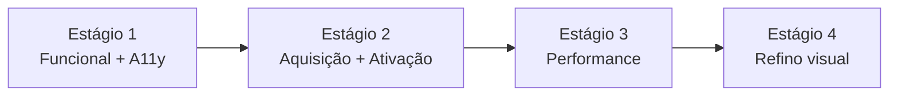
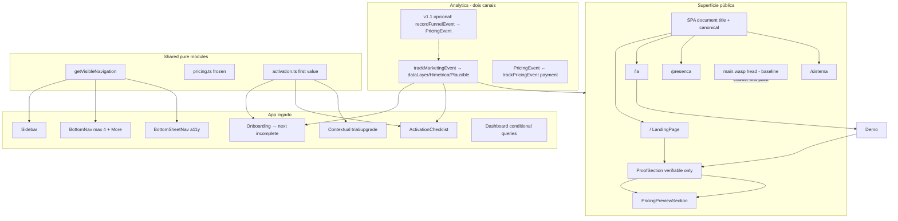
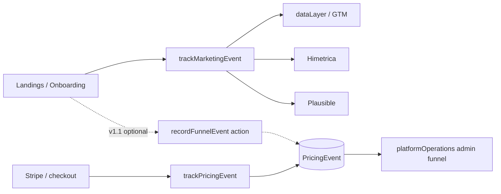
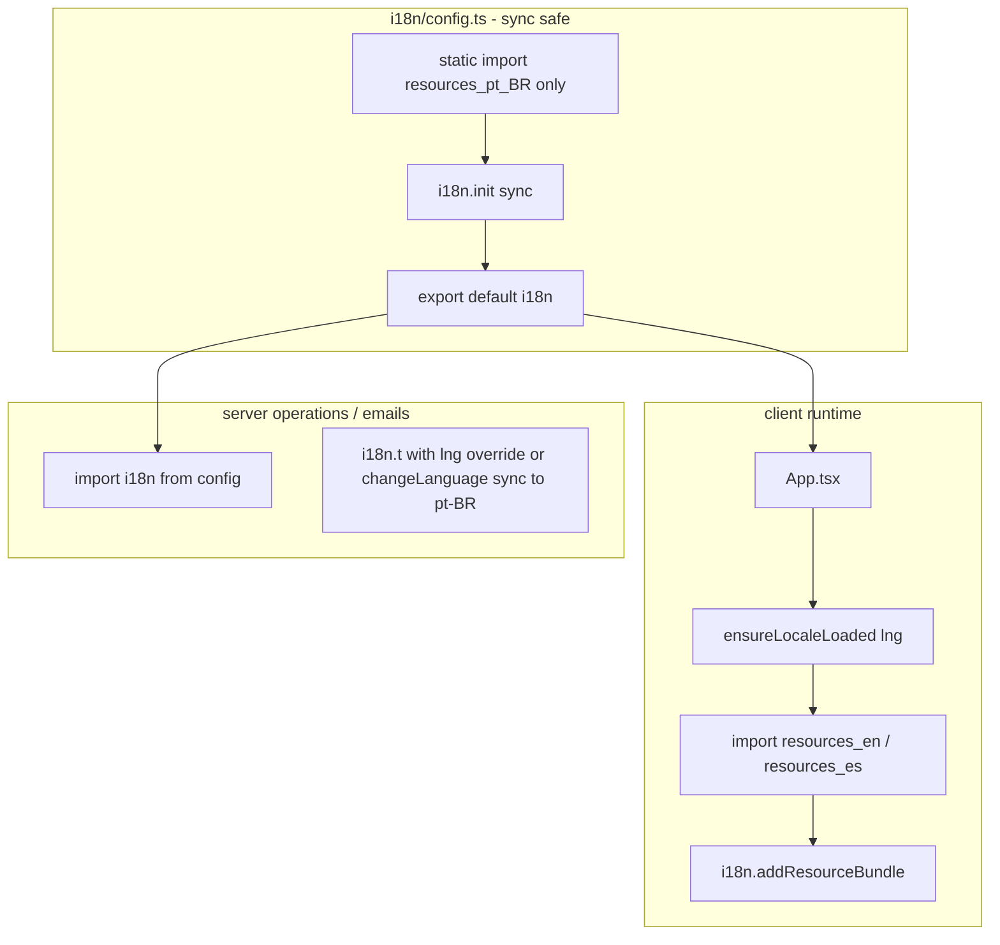
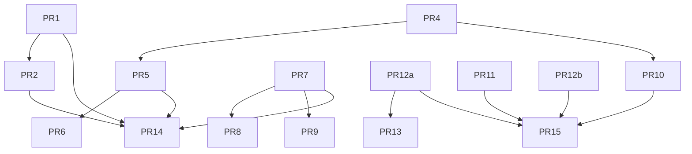

# Plano de Melhoria Equilibrada — Catequese Viva

| Campo | Valor |
|-------|--------|
| **Documento** | Design de melhoria equilibrada (aquisição, uso diário, performance, qualidade) |
| **Autor** | TBD (produto + engenharia) |
| **Data** | 2026-07-15 |
| **Status** | Draft (rev. 3 — residual PR9/PR10) |
| **Escopo de código** | `app/` (Wasp OpenSaaS), com testes em `app/tests/e2e/` e `e2e-tests/` |
| **Idioma do produto** | pt-BR (default), en, es |

---

## Overview

A Catequese Viva já possui os blocos centrais de conversão (trial de 7 dias **sem cartão** via `subscriptionStatus: 'trialing'` no signup, dois planos em `src/shared/pricing.ts`, funil client em `marketingAnalytics.ts` / Meta / Himetrica + funil admin via `PricingEvent`), onboarding (`OnboardingPage` + `ActivationChecklist`), e componentes de landing reutilizáveis (`ProofSection`, `PricingPreviewSection`, seções lazy). Porém, o produto público e logado sofrem de **desbalanceamento**: a landing principal esconde preços e prova; as três campanhas colocam preço antes do demo; title/OG no HTML inicial são genéricos; a navegação tem **caminhos de filtro distintos** (risco de drift + política de workspace ainda não codificada); o bundle i18n carrega ~571 KB de fontes em 3 idiomas no boot; a11y bloqueia zoom; e a ativação post-signup trata “primeiro valor” como classe + catequizandos sem ação real de presença ou encontro.

Este documento propõe um **plano em quatro estágios**, sem mudar trial (7 dias, sem cobrança e **sem cartão no início**) nem planos/preços (`single` R$ 29/mês e `unlimited` R$ 99/mês), sem inventar prova social, e com interfaces/métricas concretas ancoradas no código.

---

## Background & Motivation

### Estado atual (verificado no repositório)

| Área | Evidência | Dor |
|------|-----------|-----|
| Landing principal | `LandingPage.tsx` usa `hidePricing` em `PublicNavbar`/`PublicFooter`; **não** monta `PricingPreviewSection` nem `ProofSection` | Mensagem fala de trial/planos mas o usuário não vê preços nem compromissos verificáveis |
| Campanhas | **`LandingIa.tsx`, `LandingPresenca.tsx` e `LandingSistema.tsx`** montam `PricingPreviewSection` **imediatamente após o hero**, antes de demo/features | Preço antes da demonstração específica do produto da campanha (as três rotas) |
| Prova | `ProofSection.tsx` + chaves `landing.proof.*` já existem e são honestas; `TestimonialsSection.tsx` existe mas **não** deve ser populada com depoimentos fictícios | Prova social “genérica” ausente na home; risco de usar testimonials inventados |
| SEO / meta | `main.wasp` `head` único (title/description/OG fixos); rotas `/`, `/ia`, `/presenca`, `/sistema` herdam o mesmo meta HTML; **não** há Helmet/routeMeta no client | Snippet estático idêntico para campanhas; mutação SPA melhora aba/UX, **não** SEO de crawler por si só |
| Nav | Três caminhos: `Sidebar`/`BottomSheetNav` usam `filterByRole`; `BottomNav` usa `item.roles.includes(userRole)` sem o helper. `PERSONAL_OWNER` já está nas arrays `STAFF/CATECHIST/VIEWER/LEARNER` — para o `NAV_SECTIONS` **atual**, a visibilidade mobile ≈ desktop para personal owners; o mapeamento `PERSONAL_OWNER→PARISH_COORDINATOR` em `filterByRole` é defesa contra itens que listem só coordenador | Risco de **drift** se roles mudarem; sem SSOT; **política** de ocultar destinos institucionais em `PERSONAL` ainda não existe (é produto novo, não bug verificado) |
| Bottom bar | `BOTTOM_NAV_KEYS` tem 5 chaves; UI faz `slice(0, 5)` + botão More | Labels comprimidos em viewports 360–390; alvos horizontais estreitos com 6 colunas |
| i18n | `i18n/config.ts` importa `resources_pt_BR` + `en` + `es` eager; `build-i18n.mjs` gera **um bundle completo por locale** (não chunks por namespace); `loadLanguageBundle` / `loadAppNamespaces` são no-op | ~571 KB de `resources_*.ts` antes de compressão; todas as línguas no first paint |
| Hero LCP | `/landing/hero-mobile-light.png` ≈ **435 KB** (435 273 bytes), sem `width`/`height`/`srcset`; `loading="eager"` + `fetchPriority="high"` já presentes (manter) | LCP alto; CLS potencial por falta de dimensões |
| Dashboard | `DashboardPage.tsx` sempre chama `useQuery(getDashboardStats, …)` e só depois escolhe `InstitutionalDashboard` (que não usa `stats`) | Query desnecessária em workspaces institucionais elegíveis; `loading` bloqueia no stats inútil |
| A11y | `maximum-scale=1.0` em `main.wasp` L14; `BottomSheetNav` tem Escape + `role="dialog"` + `aria-modal` mas **sem** focus trap, foco inicial ou restore; backdrop é `div` click-only | Zoom bloqueado; teclado/leitores de tela fragilizados |
| Copy pt-BR | `landing.json` / `resources_pt_BR`: “Faca”, “presenca”, “coordenacao”, “De as familias”, etc. | Credibilidade de marketing |
| Copy trial | Product trial = **sem cartão** (`auth/hooks.ts` seta `trialing` sem Stripe; `isOnProductTrial` / comentário em `ProductTrialBanner`). Mas `price_trial_note` diz que trial exige cartão Stripe; chips de proof dizem “Sem cartão” | Contraditório ao montar Proof + Pricing na home |
| Ativação | `ActivationChecklist` usa `avgAttendance > 0` e `upcomingMeetings?.length`; exige **os 4** steps para `allDone`; `finishPersonal` dispara `activation_completed` com classe+catequizandos | First value desejado (OR presença/encontro) não implementável com flags atuais; `attendanceRecordsTotal` é calculado em `dashboardOperations` mas **não retornado** |
| Trial UI | `ProductTrialBanner` é faixa persistente em quase todo o app | Promo compete com ativação nos primeiros dias |
| Funil client | `trackMarketingEvent` → `dataLayer` / Himetrica / Plausible **apenas** (sem write DB) | Eventos de landing/onboarding **não** alimentam tabelas admin |
| Funil admin | `platformOperations` agrega **`PricingEvent`** (`trackPricingEvent` em payment/Stripe); `TrackedEvent` é audit Meta/Stripe, não funil de produto | Adicionar nomes a `MarketingEventName` **não** atualiza o dashboard admin; `purchaseToActivation` já é frágil para `activation_completed` client-only |

### Contexto de negócio (invariantes)

- **Product trial**: `SUBSCRIPTION_TRIAL_DAYS = 7`; status `trialing` **sem cartão** e sem cobrança no início (`onAfterSignup` + `isOnProductTrial`). Cartão Stripe só no **checkout de conversão** (assinatura paga).
- **Copy canônica (fechada)**: “7 dias grátis · sem cartão para começar · sem cobrança agora”. Corrigir `price_trial_note` e qualquer texto que afirme “trial exige cartão”. No checkout, copy separada: “Para assinar, o Stripe pede cartão; não cobramos durante o trial da assinatura se cancelar a tempo” — apenas na superfície de billing/checkout, não na landing de aquisição do product trial.
- **Planos**: `single` (2900 / 29000 centavos) e `unlimited` (9900 / 99000) — **não alterar**.
- **Sem prova social inventada**: zero depoimentos, contagens de clientes, “N paróquias usam”, estrelas fictícias até haver evidência real e autorizada.

### Validação visual

Passagem visual completa com seed ainda **pendente** (servidor web local instável na revisão; DB disponível). O estágio 4 e o PR de polish (chore) **não bloqueiam** “design complete”; executam quando `wasp start` estiver estável + `./seed_tests.sh`.

---

## Goals & Non-Goals

### Goals

1. **Aquisição balanceada**: reexibir preços e prova verificável na ordem valor → prova → preço; CTA trial; **document title/canonical SPA** por rota (v1); crawler SEO como follow-up; copy pt-BR e trial unificados.
2. **Ativação real**: first value = turma + ≥1 catequizando + (presença **ou** encontro criado/salvo); flags em `getDashboardStats`; checklist alinhado (complete = first value; passos extras opcionais); onboarding termina na próxima ação incompleta.
3. **Produto logado coerente**: `getVisibleNavigation` SSOT; bottom bar ≤4 + More; empty states com convenção existente; política PERSONAL explícita (UX, não AuthZ).
4. **Acessibilidade baseline**: zoom 200% (manual + Playwright com abordagem documentada); teclado; focus trap; alvos ≥44×44; contraste.
5. **Performance**: **locale-level** lazy i18n primeiro; hero moderno com dimensões; sem `getDashboardStats` no branch institucional; lazy charts/editors; tabs de detalhe; cache de contexto.
6. **Mensuração**: contrato client + **decisão explícita de sink** (v1 = externo; v1.1 opcional `PricingEvent`); não afirmar atualização do admin sem sink.
7. **Testes**: Playwright multi-viewport + a11y + onboarding + Lighthouse when available.

### Non-Goals

- Mudar preços, nomes de planos, ou duração do trial.
- Fabricar testimonials ou contadores de clientes.
- App nativo / redesign completo de marca.
- Reescrever billing Stripe ou cascade institucional.
- **Migration Prisma** para analytics (v1).
- Prerender/SSR completo de todas as rotas públicas no mesmo pacote de PRs de landing (follow-up SEO).
- Refatorar todas as páginas de detalhe de uma vez.
- Implementar consent gate completo de cookies/marketing se ainda não existir API — ver Security (status quo documentado).

---

## Proposed Design

### Princípio de entrega em estágios



Ordem intencional: **não** investir em polish visual se zoom, nav e copy contraditória ainda prejudicam confiança e conversão.

### Arquitetura alvo (visão)



---

### Estágio 1 — Correções funcionais + acessibilidade

#### 1.1 Navegação unificada: `getVisibleNavigation`

**Diagnóstico refinado** (não superestimar bug PERSONAL_OWNER):

| Fato | Implicação |
|------|------------|
| `BottomNav` não chama `filterByRole` | Paths de filtro **inconsistentes**; drift futuro se um item tiver `PARISH_COORDINATOR` mas não `PERSONAL_OWNER` |
| Hoje `PERSONAL_OWNER` ∈ STAFF/CATECHIST/VIEWER/LEARNER | Para `NAV_SECTIONS` atuais, bottom e sidebar **quase equivalentes** para personal owners |
| Valor real de SSOT | Uma API; 4+More; cobertura de ícones no sheet; **política workspaceType** (nova) |

**Nav filter não é AuthZ.** Ocultar `/app/parishes` na UI **não** impede deep link; o server continua enforcement. Testes de nav não substituem testes de access-control.

**Design** — `app/src/shared/navigation.ts`:

```ts
export type WorkspaceNavContext = {
  role: string;
  isAdmin: boolean;
  workspaceType?: string | null; // PERSONAL | PARISH | DIOCESE | COMMUNITY
};

export type NavSurface = 'bar' | 'sheet' | 'hidden';

export function getVisibleNavigation(ctx: WorkspaceNavContext): {
  primary: NavItemConfig[];
  more: NavItemConfig[];
  bottom: NavItemConfig[]; // section "bottom" (settings, billing, …)
  all: NavItemConfig[];
  /** Up to 4 items from BOTTOM_NAV_KEYS that remain after role+workspace filters; no padding */
  bottomBar: NavItemConfig[];
};

export const BOTTOM_NAV_KEYS = [
  'dashboard', 'classes', 'catechumens', 'calendar',
] as const; // settings → sheet only
```

**Derivação `bottomBar`**:

1. Filtrar `ALL_NAV_ITEMS` com `filterByRole` (mantém mapeamento defensivo `PERSONAL_OWNER→PARISH_COORDINATOR`).
2. Aplicar **filtro workspaceType** (tabela abaixo).
3. `bottomBar = BOTTOM_NAV_KEYS.map(find).filter(Boolean)` — se algum key sumir por role, a barra tem **menos colunas** (grid `visible.length + 1`); **não** preencher com itens secundários automaticamente (previsibilidade).
4. Sheet = `(primary ∪ more ∪ bottom sections) − bottomBar`, na ordem das seções.
5. `isAdmin`: como hoje, `filterByRole` retorna todos os items; item `admin` tem `roles: []` e só entra quando `isAdmin` (sidebar já trata admin à parte — **preservar** comportamento: `getVisibleNavigation` deve incluir `/admin` se `isAdmin`).

**Política `workspaceType === 'PERSONAL'`** (UX; lista canônica de `iconKey` ocultos no sheet/sidebar para personal):

| iconKey | PERSONAL | Motivo |
|---------|----------|--------|
| `parishes` | hidden | Multi-paróquia institucional |
| `communities` | hidden | Hierarquia paroquial |
| `catechetical_years` | hidden | Ano catequético institucional |
| `reports` | hidden | Relatórios de coordenação multi-turma/paróquia (reavaliar se personal reports forem úteis depois) |
| demais | conforme role | — |

**Ícones**: ICON_MAP permanece **local** a cada componente (Sidebar / BottomNav / BottomSheetNav). **Requisito de aceite PR2**: todo `iconKey` que possa aparecer no sheet após filtros tem entrada no map do sheet (hoje faltam p.ex. `consents`, `catechetical_years`, `admin` — completar ou fallback genérico `Circle`).

**Consumidores**: `Sidebar.tsx`, `BottomNav.tsx`, `BottomSheetNav.tsx`; testes em `navigation-access.test.ts` + casos PERSONAL hide keys.

#### 1.2 Bottom bar: 4 + More

- Grid: `repeat(visible.length + 1, 1fr)` com no máximo 5 colunas (4 + More).
- Labels: `title` + `aria-label` completos se truncar.
- Alvos: célula full height da barra (~3.5rem + safe-area); com 4+More a largura por alvo melhora vs 6 colunas.

#### 1.3 Acessibilidade de overlays e interação

**Viewport** (`main.wasp`):

```html
<meta name='viewport' content='width=device-width, initial-scale=1.0, viewport-fit=cover' />
```

Remover `maximum-scale=1.0` (e espelho em layout gerado após recompile).

**BottomSheetNav → preferir `Sheet` de `src/client/components/ui/sheet.tsx` (Radix)**  
Após migração, **re-testar** com `scripts/patch-radix-focus-scope.cjs` (patch existente pode afetar focus scope).

**Aceite PR1**:

| Critério | Detalhe |
|----------|---------|
| Focus trap | Tab/Shift+Tab ciclam **dentro** do sheet |
| Foco inicial | Close control (ou primeiro link) ao abrir |
| Restore | Foco volta ao botão **More** ao fechar |
| Escape | Fecha (já parcialmente implementado) |
| Backdrop | Fecha e não deixa foco “atrás” interativo sem dismiss |

**Zoom 200%**: aceite manual no browser (pinch / Ctrl+). Em Playwright: preferir `page.evaluate(() => { document.body.style.zoom = '2' })` **ou** viewport half-size simulation — documentar no spec que “zoom 200%” e2e é **aproximação CSS**, não chrome de pinch; regressão real de `maximum-scale` é assert no HTML gerado (`content` do viewport meta **não** contém `maximum-scale`).

**Listas / empty states**:

- Rows: `Link` ou `button`, não `div`/`tr` com só `onClick`.
- **`EmptyState` API real** (`EmptyState.tsx`): `title`, `description?`, `children?`, `compact`/`minimal`/`inline`, `icon?`. **Não** inventar `actionLabel`/`actionTo`.
- **Convenção padronizada**:

```tsx
<EmptyState icon={Users} title={…} description={…}>
  <Button asChild>
    <Link to={ctaTo}>{ctaLabel}</Link>
  </Button>
</EmptyState>
```

Um único CTA contextual via `children`.

#### 1.4 Copy pt-BR sem acentos

Corrigir **JSON fonte** (`locales/pt-BR/*.json`); `npm run i18n:build && npm run i18n:check`. PR de acentos **antes** de qualquer PR que reestruture imports de `resources_*.ts` (evita conflito de merge no gerado).

---

### Estágio 2 — Aquisição / ativação

#### 2.1 Landings: ordem valor → prova → preço

**Home** (`LandingPage.tsx`):

```
PublicNavbar (pricing VISÍVEL — remover hidePricing)
HeroSection (trial-first; CTA unificado)
OutcomesSection / StepsSection
ProofSection
PricingPreviewSection (lazy, id=planos)  // price_trial_note corrigido
FaqSection
CtaSection
PublicFooter
MobileStickyCta
```

**Campanhas** (`/ia`, `/presenca`, `/sistema` — **todas as três**):

```
Hero
[Demo: AiShowcase | Features attendance-first | Features gestão]
FeaturesSection (order por campanha)
ProofSection
PricingPreviewSection   ← DEPOIS do demo (hoje está logo após o hero)
…
```

#### 2.2 Prova: só compromissos verificáveis + copy trial alinhada

Usar `ProofSection`; **não** montar `TestimonialsSection` com dados inventados.

| Permitido | Proibido |
|-----------|----------|
| Trial 7 dias sem cartão; sem cobrança agora; cancelamento simples | Contagens de clientes, “N paróquias” |
| Mobile browser; CSV; presença; portal família | Depoimentos sem autorização |
| LGPD; revisão humana da assistência editorial | Selos não obtidos |
| Fit por audiência descritivo | Estrelas 5★ genéricas |

**PR5 acceptance (obrigatório — Issues 6/14)**:

- Unificar chips `proof.chips`, `price_trial_note`, FAQ e CTAs: **product trial sem cartão**.
- Remover/reescrever qualquer “O trial exige cartão (Stripe)” na superfície de landing.
- CTA primário: **“Começar trial de 7 dias”** + helper **“sem cobrança agora · sem cartão para começar”** + outcome.
- Instrumentação `primary_cta_clicked` preservada.

#### 2.3 Metadata: honestidade SPA vs crawler

**v1 (este plano)**:

- Novo `app/src/landing-page/routeMeta.ts` + `useRouteDocumentMeta()` em cada landing (ou `App.tsx` por path).
- Atualiza: `document.title`, `<meta name="description">` se presente no DOM, `link[rel=canonical]`, e OG tags **se** já existirem no documento (mutação client).
- Benefício: UX de aba, analytics page title, alguns scrapers com JS.

**Fora de v1 (follow-up SEO crawler-true)**:

- HTML first response ainda vem de `main.wasp` `head` único.
- Opções futuras: (a) prerender estático das 4 rotas no pipeline de deploy; (b) edge worker que injeta meta por path; (c) páginas shell HTML por campanha servidas pelo reverse proxy. **Nenhuma** está no escopo dos PRs de landing atuais.
- Goal #1 reformulado: “metadata SPA por rota + baseline global; SEO crawler como follow-up”.

#### 2.4 Analytics: dois canais — não confundir



**Decisão v1 (Path A — default)**:

- Estender `MarketingEventName` com `onboarding_completed`, `activation_milestone_completed`, `first_value_reached`.
- Emitir só via `trackMarketingEvent` (client).
- **Não** afirmar que o admin `AnalyticsDashboard` / `platformOperations` passa a contar esses eventos.
- Métricas de ativação 24h / TTFV: export Himetrica/Plausible/GTM; `duration_ms` e `landing_origin` nas props do evento client.
- Documentar que `purchaseToActivation` e similares baseados em `PricingEvent` **já** não capturam bem `activation_completed` client-only.

**Path B (v1.1 opcional, sem migration)**:

- Action autenticada `recordFunnelEvent({ event, sessionId?, … })` que chama o mesmo shape de `trackPricingEvent` → `PricingEvent` (campos existentes: `event`, `userId`, `sessionId`, `fromPlan`/`toPlan` opcionais para path/milestone codificados com cuidado privacy-safe).
- Allowlist **server-side** de event strings na action (não em “FUNNEL_EVENTS do platformOperations” como se o client escrevesse lá).
- Admin passa a ver contagens se `platformOperations` incluir os novos `event` names na agregação.
- Idempotência first value: `sessionId` ou dedupe client `cv-first-value-sent` + opcional unique lógico best-effort.

**Payload client (privacy-safe)**:

```ts
{
  profile: "personal" | "institutional" | "guardian" | …,
  workspace_type: "PERSONAL" | "PARISH" | …,
  landing_origin: "general" | "ai" | "attendance" | "management" | null,
  duration_ms?: number,
  path: "attendance" | "meeting",
  milestone?: "class" | "people" | "attendance" | "meeting",
}
```

Sem nomes, e-mails ou IDs de menores.

#### 2.5 Onboarding e first value

**Definição canônica (ICP aquisição = catequista / personal / staff de turma)**:

```
hasClass && hasPeople && (hasAnyAttendance || hasAnyMeeting)
```

**Flags em `getDashboardStats` (PR7 — obrigatório, não deixar para perf)**:

| Campo retornado | Fonte já existente em `dashboardOperations` |
|-----------------|-----------------------------------------------|
| `hasAnyAttendance: boolean` | `attendanceRecordsTotal > 0` (count já calculado, **não retornado** hoje) |
| `hasAnyMeeting: boolean` | Count de `Meeting` no escopo do user/parish **sem** filtrar só `upcoming` (qualquer encontro criado/salvo) |
| Manter | `avgAttendance`, `upcomingMeetings`, `myClasses`, etc. |

**Não** usar `avgAttendance > 0` como proxy (falha se só houver faltas / média 0).

**Checklist vs first value**:

| Conceito | Regra |
|----------|--------|
| First value | OR de presença **ou** encontro (além de class+people) |
| Checklist “complete” / hide | **= first value** (não exigir os dois ramos) |
| UI | Um **next step** em destaque; passos futuros como dica opcional (“bônus”: se first value veio só de presença, sugerir criar encontro — e vice-versa — **sem** bloquear complete) |
| `activation_completed` | Manter emissão em `finishPersonal` por **compatibilidade** com funis externos; semanticamente = milestone `people` (class+catechumens). Novo `first_value_reached` carrega a definição plena. Documentar no PR8 |

**Escopos de role (default de implementação até produto refinar Open Q legado)**:

| Perfil | First value v1 |
|--------|----------------|
| PERSONAL_OWNER / catequista staff de turma | Definição canônica acima |
| Coordenação institucional | Mesma definição no parish ativo (primeira turma com pessoa + ação) |
| GUARDIAN / CATECHUMEN | **Fora** do checklist de ativação de aquisição paga; não forçar `ActivationChecklist` de staff |

#### 2.6 Upgrade contextual — state machine corrigida

**Escopo de `getTrialBannerMode`**: apenas usuários ainda no **product trial** (mesmo guard de `ProductTrialBanner` hoje: `isOnProductTrial` / institutional trial). Limites de plano **não** entram nesta função.

**Estados mutuamente exclusivos** (nunca `hasReachedFirstValue` em OR de urgência; **nunca** `hasHardPlanLimit` aqui):

```ts
type TrialBannerMode = 'hidden' | 'soft' | 'urgency';

/** Call only when isOnProductTrial (or institutional trial) is true. */
function getTrialBannerMode(args: {
  daysLeft: number | null;
  hasReachedFirstValue: boolean;
  softDismissed: boolean; // localStorage cv-soft-upgrade-dismissed
}): TrialBannerMode {
  const { daysLeft, hasReachedFirstValue, softDismissed } = args;
  const isActivating = !hasReachedFirstValue;

  // Near end of trial: sticky urgency strip (existing ProductTrialBanner chrome)
  if (daysLeft != null && daysLeft <= 2) return 'urgency';

  // Mid-trial, still activating: hide upgrade promo (checklist owns attention)
  if (isActivating) return 'hidden';

  // Saw value, not near end: soft dismissible card (unless user dismissed)
  if (hasReachedFirstValue && !softDismissed) return 'soft';

  return 'hidden';
}
```

**Mode → componente (exclusão mútua de CTAs)**:

| Mode | Componente / markup | CTA upgrade? |
|------|---------------------|--------------|
| `hidden` | Não renderizar nada de trial-promo | Não |
| `soft` | **Mesmo** `ProductTrialBanner.tsx` com branch de markup: card dismissível (borda suave, botão fechar) — **não** a faixa sticky full-width de urgência. Persist dismiss em `cv-soft-upgrade-dismissed` | CTA secundário “Ver planos” opcional |
| `urgency` | Faixa sticky atual de `ProductTrialBanner` (clock + CTA billing) quando `daysLeft ≤ 2` | Sim, um CTA de billing |

**Limite de plano / hard gate — fora do trial banner**:

| Situação | UI responsável | Trial banner |
|----------|----------------|--------------|
| Atingiu limite de turma/catequizandos/etc. | **`PlanLimitBanner`** / `UsageNoticeCard` / toast `planLimitToast` (já existentes) | **Não** promove limite; se trial mode seria `soft`/`urgency`, preferir **não empilhar**: se `PlanLimitBanner` visível na mesma view, trial soft **não** renderiza (`mode` forçado a comportamento hidden para soft apenas; urgency de “≤2 dias” pode permanecer **acima** do conteúdo se ainda em trial — mas **um** CTA de upgrade por região: trial strip no `AppShell`, limit banner no contexto da página) |
| `SubscriptionGate` bloqueio hard | Gate full-page / redirect billing | Trial strip **oculto** nas rotas de onboarding/billing (já); em gate, não duplicar CTA do strip |

Regra de implementação PR9:

1. `getTrialBannerMode` **não** recebe `hasHardPlanLimit`.
2. Soft = branch no **mesmo** arquivo `ProductTrialBanner` (prop/mode), sibling component opcional só se extrair `ProductTrialSoftCard` no mesmo PR por clareza de JSX — mesmo ponto de montagem em `AppShell`.
3. Antes de render `soft`, checar se a página já monta `PlanLimitBanner` com limite ativo: se sim, `return null` no soft (evitar double CTA). Detecção simples: prop opcional `suppressSoft` do shell **ou** soft só no dashboard quando não há limit banner — preferência: **soft só em layout global com prioridade menor que limit banners locais**; se ambos competirem, limit vence e soft some.
4. Urgency (≤2 dias) e `PlanLimitBanner` na mesma página: permitido apenas se copy for distinta (tempo do trial vs capacidade do plano); CTAs podem ambos ir a `/app/billing` com `source` diferente (`trial_banner` vs `limit_banner`) — aceitável. **Não** transformar urgency em segundo limit banner.

`isActivating` = está em trial **e** ainda não atingiu first value.

Reutilizar `buildBillingJourneyHrefFromContext` com `source` `'trial_banner' | 'post_activation'`.

#### 2.7 Pricing na nav

Remover `hidePricing` na home; âncora `#planos`; não alterar amounts.

---

### Estágio 3 — Performance e responsividade

#### 3.1 i18n — faseado e alinhado a `build-i18n.mjs`

**Estado do pipeline**: `scripts/build-i18n.mjs` gera **um arquivo por locale** (`resources_pt_BR.ts`, `resources_en.ts`, `resources_es.ts`), cada um com **todos** os namespaces. Não gera grupos `public` / `app-core`.

**Fase 3.1.a — PR10 (locale-level; dual-safe client/server)**:

**Problema de bootstrap (obrigatório no desenho)**: `app/src/i18n/config.ts` é import síncrono com side-effect de:

| Entrypoint | Exemplos |
|------------|----------|
| Client | `client/App.tsx` (`import "../i18n/config"`), cookie consent, toasts, ErrorBoundary, `planLimitToast`, landings |
| Server | `server/operations/onboardingOperations.ts`, `auth/email-and-pass/emails.ts` |

Top-level `await import()` no módulo compartilhado **quebra** Node/Wasp server e first-paint `i18n.t` síncrono.

**Arquitetura dual-safe (canônica para PR10)**:



**Regras de implementação**:

1. **Sync init sempre**: `i18n.init({ …, useSuspense: false })` no load do módulo; export da instância nunca lança.
2. **Eager mínimo no bundle compartilhado**: import estático **somente** `resources_pt_BR` (fallbackLng + server + default product). **Não** importar `resources_en` / `resources_es` estaticamente em `config.ts`.
3. **Server**: continua `import i18n from '../../i18n/config'` — sempre tem pt-BR completo. E-mails/onboarding que precisam de outra língua: `i18n.getFixedT(userLocale, ns)` **somente se** o bundle já estiver no resources; se server precisar de en/es no futuro, **eager server-side** via import estático condicional em helper server-only (`server/i18n/loadServerResources.ts`) — **não** dynamic import de chunk Vite no server no PR10. Default PR10: server strings em pt-BR (ou locale se já for pt-BR); se `emails.ts` já usa locale do user, manter pt-BR bundle + fixedT e documentar gap en/es server até follow-up.
4. **Client boot**:
   - `resolveInitialLocale()` (localStorage / navigator).
   - Se locale === `pt-BR`: ready imediato (já eager).
   - Se locale === `en` | `es`: `ensureLocaleLoaded(locale)` faz `import('./resources_en')` (dynamic, client-only) + `addResourceBundle` para cada ns + `i18n.changeLanguage(locale)`.
   - `App.tsx`: gate de render — `useState`/`useEffect` ou pequeno `I18nReady` que espera `ensureLocaleLoaded` **antes** de montar rotas (spinner mínimo / null). Evita flash de keys; `useSuspense: false` permanece.
5. **`loadLanguageBundle(lang)`**: implementação real no client; no-op seguro se `typeof window === 'undefined'`.
6. **LanguageSwitcher**: chama `ensureLocaleLoaded` antes de `changeLanguage`.
7. **`build-i18n.mjs` / `i18n:check`**: inalterados (ainda geram 3 bundles completos).
8. **Testes PR10**:
   - Unit: `import config` em contexto Node (vitest) **não throw**; `i18n.t` retorna string pt-BR.
   - Unit/mock: `ensureLocaleLoaded('en')` registra bundle (mock dynamic import).
   - Aceite rede: com lng pt-BR, chunk `resources_en` / `resources_es` **não** no graph inicial do client; com lng en, apenas en (+ pt-BR eager já no main).

**Anti-patterns proibidos no PR10**:

- Top-level await em `config.ts`
- Dynamic `import()` executado no path de `onboardingOperations` / emails
- Esvaziar `resources` no init “e preencher depois” sem pt-BR eager (quebra server + first t())

**Fase 3.1.b — follow-up (PR separado, não no mesmo PR10)**:

- Estender `build-i18n.mjs` para grupos opcionais (`publicNs`, `appCoreNs`) **ou** dynamic import por namespace.
- Opcional: `config.client.ts` vs re-export server se o grafo Wasp exigir split físico mais rígido.
- Server en/es completo se e-mails multi-idioma forem requisito.
- `loadAppNamespaces()` no `AppShell`.
- Resources só dados, nunca UI (evitar ciclos Vite).

#### 3.2 Hero image

- Tamanho real: **~435 KB** PNG.
- Gerar AVIF/WebP + widths 640/960/1280; `width`/`height` no markup; `srcset`/`sizes`.
- **Preservar** `loading="eager"` e `fetchPriority="high"`.

#### 3.3 Dashboard: pular `getDashboardStats` quando institucional

```tsx
const isInstitutional =
  INSTITUTIONAL_TYPES.includes(workspaceType) &&
  INSTITUTIONAL_PLANS.includes(workspacePlan) && // inclui aliases legacy parish/diocese
  STAFF_ROLES.includes(userRole);

const { data: stats, isLoading: loadingStats } = useQuery(
  getDashboardStats,
  { parishId: activeParishId || undefined },
  {
    enabled: !loadingCtx && !isInstitutional,
    staleTime: 60000,
    refetchOnWindowFocus: false,
  },
);

if (loadingCtx || (!isInstitutional && loadingStats)) return <SkeletonPage />;
if (isInstitutional) return <InstitutionalDashboard />;
```

Teste: unit/integration garantindo `enabled === false` no path institucional (mock de hooks) ou assert de que `InstitutionalDashboard` monta sem esperar stats.

#### 3.4 Lazy-load e code splitting (PRs separados)

| PR | Escopo |
|----|--------|
| Stats skip institucional | só `DashboardPage` (+ teste) |
| Lazy charts / reports / RichContentEditor | imports lazy |
| Tabs detalhe turma/catequizando/família | `?tab=` deep link |

#### 3.5 Cache compartilhado de contexto

Alinhar keys/staleTime de `useUserContext` / workspace; invalidar em `workspace-changed` e pós-onboarding.

#### 3.6 Metas CWV

LCP ≤ 2.5s, CLS ≤ 0.1, INP ≤ 200ms p75 — medidos when server disponível (chore, não gate de design).

---

### Estágio 4 — Refino visual

Após S1–S3 estáveis; seed; microcelebração first value; screenshots opcionais. Não redesenhar tokens.

---

## API / Interface Changes

### Client

```ts
// shared/navigation.ts
export function getVisibleNavigation(ctx: WorkspaceNavContext): VisibleNav;

// client/analytics/marketingAnalytics.ts — Path A
export type MarketingEventName =
  | /* existentes */
  | "onboarding_completed"
  | "activation_milestone_completed"
  | "first_value_reached";

// landing-page/routeMeta.ts — SPA only
export function getLandingRouteMeta(path: string, locale: string): RouteMeta;
export function useRouteDocumentMeta(meta: RouteMeta): void;

// catequese/lib/activation.ts
export function isFirstValueReached(s: ActivationState): boolean;
export function nextActivationAction(...): { to: string; milestone: string };
export function getTrialBannerMode(...): 'hidden' | 'soft' | 'urgency';
```

### Server

**PR7**: estender retorno de `getDashboardStats` com `hasAnyAttendance`, `hasAnyMeeting` (e opcionalmente `attendanceRecordsTotal`, `meetingsTotal`) — **mesma operation**, entities já listadas em `main.wasp`.

**PR8 Path A**: nenhuma operation nova.

**PR8 Path B (v1.1)**: action `recordFunnelEvent` + entities `[PricingEvent]` (e User se auth); allowlist de strings no server.

**Não** tratar `TrackedEvent` como sink de funil de produto (é audit Meta/Stripe).

### i18n / EmptyState

- EmptyState: **sem** mudança de API obrigatória; convenção `children` + `Button asChild`.
- Copy trial unificada em `landing` / `billing` / FAQ.

---

## Data Model Changes

**Nenhuma migration obrigatória.**

Client keys: `cv-activation-checklist-dismissed`, `cv-first-value-sent`, `cv-soft-upgrade-dismissed`, `catequese-viva-locale`.

Futuro opcional: `User.firstValueReachedAt` se lifecycle e-mail exigir.

---

## Alternatives Considered

### A1. Home sem preços (status quo)
Rejeitado — transparência após valor.

### A2. Testimonials placeholder
Rejeitado — ética / política no-fake-social-proof.

### A3. Feature flags remotas para todo o plano
Rejeitado como default — PRs ordenados + homolog; env só se necessário.

### A4. i18n HTTP backend
Adiado — preferir dynamic import de bundles por locale (fase a); HTTP só se chunks ainda grandes.

### A5. Bottom nav 5 sem More
Rejeitado — legibilidade 360px.

### A6. First value = class + people only (status quo `activation_completed`)
- **Prós**: já instrumentado; checklist mais curta.
- **Contras**: não prova uso real (presença/encontro); retenção frágil.
- **Decisão**: rejeitado para a **definição de first value**; manter evento legado como milestone `people`.

### A7. Checklist linear exigindo presença **e** encontro
- **Prós**: cobertura completa do produto.
- **Contras**: conflita com first value OR; alonga ativação.
- **Decisão**: complete = first value; segundo ramo é bônus.

### A8. Persistir first value só server vs só localStorage
- **localStorage v1**: rápido, sem migration; perde cross-device.
- **PricingEvent / User field**: durable, admin-visible com Path B.
- **Decisão**: localStorage + client events em v1; Path B opcional.

### A9. Analytics sink: só externo vs PricingEvent
- **Externo (A)**: zero backend; admin inalterado.
- **PricingEvent (B)**: reutiliza modelo; admin pode agregar; cuidado para não misturar com eventos de billing.
- **Decisão**: A em v1; B documentado como v1.1.

---

## Security & Privacy Considerations

| Risco | Severidade | Mitigação |
|-------|------------|-----------|
| Analytics com PII | Média | Props só enums/contagens; sem nomes de menores |
| Marketing sem consent | Média | **Status quo documentado**: `trackMarketingEvent` **não** checa consent hoje; Plausible em `App.tsx` sem gate óbvio. **Fora de escopo** deste plano reimplementar CMP. Se no futuro houver API de consent, chamar **antes** de `trackMarketingEvent` / pixel — não afirmar mitigação inexistente |
| Nav hide ≠ AuthZ | Alta se mal interpretado | Deep links ainda exigem server checks; testes de access-control permanecem |
| Zoom/a11y | Inclusão | Remover maximum-scale |
| Depoimentos falsos | Ética | Só ProofSection verificável |
| PricingEvent funnel misuse | Baixa | Allowlist de eventos se Path B |

---

## Observability

### Client funnel (Path A)
`landing_viewed` → CTAs → `pricing_viewed` → signup → onboarding steps → `onboarding_completed` → milestones → `first_value_reached`  
Providers: dataLayer, Himetrica, Plausible (+ Meta via fluxos existentes).

### Admin funnel (PricingEvent)
Continua refletindo **payment/Stripe**-centric events via `trackPricingEvent`. **Não** atualiza com Path A.

### Produto KPIs
| Métrica | Fonte v1 |
|---------|----------|
| Conversão por landing | Plausible/GTM props `landing` |
| Ativação 24h / TTFV | props `first_value_reached` + timestamps client/export |
| D7 | analytics de sessão existente |
| Trial → paid | Stripe / PricingEvent (já) |

---

## Rollout Plan

Homolog por PR; rollback de landing isolado; nav Sidebar+Bottom+Sheet no mesmo PR.  
Flags: opcional `REACT_APP_SHOW_HOME_PRICING`.  
PR15 (Lighthouse/visual) é **chore** quando server ok — **não** gate de design complete.

---

## Risks

| Risco | Severidade | Mitigação |
|-------|------------|-----------|
| Pseudo-lógica trial errada | Crítica se reintroduzida | State machine §2.6; testes unitários `getTrialBannerMode` |
| Confundir client events com admin | Alta | Path A/B explícitos |
| SEO overclaim | Média | SPA-only v1; follow-up crawler |
| Flags first value erradas | Alta | Retornar counts reais no PR7 |
| Merge i18n gerado | Média | PR4 JSON → build antes de PR10 |
| Lazy i18n flash | Média | Locale bundle completo no boot; fallback pt-BR |
| PR a11y listas aberto demais | Média | Inventário fechado PR3 |

---

## Open Questions

1. ~~Sem cartão vs Stripe note~~ — **FECHADA**: product trial sem cartão; corrigir copy no PR5.
2. **First value guardian** — default v1: fora do checklist de staff; confirmação de produto se ICP mudar.
3. Settings só no More — recomendado sim; feedback de power users em homolog.
4. OG image por campanha — reutilizar `public-banner.webp` em v1; assets dedicados follow-up.
5. Path B (`PricingEvent`) no mesmo quarter? — default não; só se admin KPIs forem bloqueadores.

---

## Key Decisions

| # | Decisão | Rationale |
|---|---------|-----------|
| D1 | 4 estágios a11y→aquisição→perf→visual | Confiança antes de polish |
| D2 | Trial 7d + preços congelados | Invariante comercial |
| D3 | Só ProofSection verificável | Ética; sem fake social proof |
| D4 | Preço depois de valor (home + 3 campanhas) | Transparência sem price-first |
| D5 | `getVisibleNavigation` SSOT + política PERSONAL explícita | Drift de filtros + UX institucional; não superestimar bug atual de PERSONAL_OWNER |
| D6 | Bottom bar max 4 + More | Legibilidade mobile |
| D7 | First value inclui ação real (OR) | Ativação = uso |
| D8 | Checklist complete = first value; single next | Evita OR vs AND confuso |
| D9 | Trial banner: hidden / soft / urgency **sem** OR de first value; hard limits só em `PlanLimitBanner` | Ativação > cobrança mid-trial; sem double CTA |
| D10 | Analytics v1 = client/external only; admin via PricingEvent inalterado | Código real de sinks |
| D11 | i18n: eager pt-BR sync + client dynamic en/es; server safe; NS groups depois | Multi-entrypoint `config.ts` (App + operations + emails) |
| D12 | Remover maximum-scale | A11y |
| D13 | Skip stats no dashboard institucional | Latência/carga |
| D14 | CTA + copy: trial sem cartão / sem cobrança agora | Product trial real no código |
| D15 | Meta v1 = SPA; crawler SEO follow-up | Honestidade técnica Wasp head |
| D16 | EmptyState via `children` CTA | API existente |
| D17 | Nav filter ≠ AuthZ | Segurança |

---

## References

- `app/AGENTS.md`, `app/src/shared/pricing.ts`, `navigation.ts`
- `LandingPage.tsx`, `LandingIa.tsx`, `LandingPresenca.tsx`, `LandingSistema.tsx`
- `ProofSection.tsx`, `PricingPreviewSection.tsx`, `HeroSection.tsx`
- `marketingAnalytics.ts`, `payment/pricingEvents.ts`, `server/operations/platformOperations.ts`
- `dashboardOperations.ts` (`attendanceRecordsTotal` não retornado)
- `auth/hooks.ts` (product trial sem Stripe)
- `BottomNav.tsx`, `BottomSheetNav.tsx`, `Sidebar.tsx`, `ui/sheet.tsx`
- `EmptyState.tsx`, `ActivationChecklist.tsx`, `ProductTrialBanner.tsx`
- `i18n/config.ts`, `scripts/build-i18n.mjs`, `main.wasp`
- `schema.prisma` — `PricingEvent`, `TrackedEvent`

---

## PR Plan

### PR1 — A11y viewport + BottomSheet focus
- **Título**: `fix(a11y): remove maximum-scale and harden BottomSheetNav focus`
- **Arquivos**: `main.wasp`; `BottomSheetNav.tsx` e/ou migração para `ui/sheet.tsx`; re-test patches Radix
- **Deps**: nenhuma
- **Descrição**: Remover maximum-scale; focus trap, foco inicial no close, restore no More, Escape, backdrop; aceite documentado; Playwright assert viewport meta + smoke focus (zoom 200% documentado como aproximação CSS).

### PR2 — `getVisibleNavigation` + bottom 4 + More + ícones sheet
- **Título**: `fix(nav): centralize getVisibleNavigation and limit bottom bar to 4`
- **Arquivos**: `shared/navigation.ts`; `Sidebar.tsx`; `BottomNav.tsx`; `BottomSheetNav.tsx`; `navigation-access.test.ts`
- **Deps**: PR1 recomendado
- **Descrição**: SSOT; PERSONAL hide table; bottomBar sem pad; icon coverage no sheet; testes SSOT + “nav is not AuthZ” comment nos tests.

### PR3 — Listas a11y com inventário fechado
- **Título**: `fix(a11y): keyboard-accessible rows on core list pages`
- **Arquivos (cap)**: `ClassesPage.tsx`, `CatechumensPage.tsx`, `pages` de families se row-click, `EmptyState` **usages only** (sem mudar API); opcional `MeetingsPage.tsx`
- **Deps**: nenhuma rígida
- **Descrição**: Inventário fechado — **não** “todas as listas do app”. Convenção EmptyState + `Button asChild` + `Link`.

### PR4 — Ortografia pt-BR (JSON only + build)
- **Título**: `fix(i18n): restore Portuguese accents on public landing copy`
- **Arquivos**: `locales/pt-BR/landing.json` (+ FAQ/billing se trial note aqui); regenerate `resources_pt_BR.ts` **neste PR**
- **Deps**: nenhuma; **deve mergear antes de PR10**
- **Descrição**: Acentos; se tocar trial strings, alinhar com decisão sem cartão **ou** deixar trial note para PR5 se preferir um único PR de copy comercial — **recomendado**: acentos em PR4; trial commercial copy em PR5 para review de produto.

### PR5 — Home: Proof + Pricing + CTA + unificação trial copy
- **Título**: `feat(landing): proof and pricing after value; unify no-card trial copy`
- **Arquivos**: `LandingPage.tsx`; nav/footer usage; `HeroSection` keys; `locales/*/landing.json` (`price_trial_note`, chips, FAQ, CTAs); **não** Testimonials
- **Deps**: PR4 (merge limpo de JSON)
- **Descrição**: Ordem valor→prova→preço; aceites Issues 6/14; sem fake social proof.

### PR6 — Três campanhas: pricing após demo + meta SPA
- **Título**: `feat(landing): reorder all campaign pricing and SPA route meta`
- **Arquivos**: `LandingIa.tsx`, `LandingPresenca.tsx`, `LandingSistema.tsx`; `routeMeta.ts` + hook; **não** afirmar crawler SEO
- **Deps**: PR5
- **Descrição**: As três rotas; title/canonical client-side; follow-up SEO documentado no PR description.

### PR7 — First value + stats flags + checklist + completion
- **Título**: `feat(activation): first-value flags, checklist, and next-action completion`
- **Arquivos**: `dashboardOperations.ts` + `main.wasp` entities se faltar Meeting count; `DashboardPage` consumers de stats; `activation.ts`; `ActivationChecklist.tsx`; `OnboardingPage.tsx`; `CompletionStep.tsx`; i18n dashboard/onboarding; testes unitários activation + stats shape
- **Deps**: nenhuma rígida
- **Descrição**: `hasAnyAttendance` / `hasAnyMeeting`; complete = first value; next incomplete; **não** depender de PR de perf.

### PR8 — Analytics Path A (+ opcional stub Path B)
- **Título**: `feat(analytics): first_value and onboarding events (client funnel)`
- **Arquivos**: `marketingAnalytics.ts`; call sites; testes de nomes; **não** “allowlist platformOperations” como sucesso
- **Deps**: PR7
- **Descrição**: Path A only em v1; README/PR body: admin PricingEvent inalterado; e2e smoke dataLayer opcional. Path B só se produto priorizar no mesmo ciclo (PR8b separado).

### PR9 — Trial banner state machine
- **Título**: `feat(billing): contextual trial banner modes hidden/soft/urgency`
- **Arquivos**: `ProductTrialBanner.tsx` (branch soft card vs urgency strip); opcional `ProductTrialSoftCard` sibling; `getTrialBannerMode` em `activation.ts`; i18n billing; testes unitários da state machine; `AppShell.tsx` se props
- **Deps**: PR7 (first value signal)
- **Descrição**: Implementar §2.6: modes → markup table; soft + `cv-soft-upgrade-dismissed`; **sem** `hasHardPlanLimit` na trial machine; hard limits permanecem em `PlanLimitBanner` / gate; soft oculto se limit banner ativo na view; nunca OR first value em urgency.

### PR10 — i18n locale-level load (client dynamic, server-safe)
- **Título**: `perf(i18n): eager pt-BR plus client-only dynamic en/es locales`
- **Arquivos**: `i18n/config.ts`; `ensureLocaleLoaded` helper; `client/App.tsx` ready gate; `LanguageSwitcher.tsx`; `i18n.test.ts` (Node import + load mock); **não** alterar paths server além de verificar que `onboardingOperations` / `emails` ainda resolvem `t()`
- **Deps**: **PR4 merged**
- **Descrição**: Fase 3.1.a dual-safe: sync init + static `resources_pt_BR` only; dynamic import en/es **client-only**; `loadLanguageBundle` real no browser / no-op no server; proibir top-level await; teste `import config` em Vitest Node não throw; aceite: pt-BR first load sem chunks en/es.

### PR11 — Hero image
- **Título**: `perf(landing): responsive hero with dimensions and modern formats`
- **Arquivos**: `public/landing/*`; `HeroSection.tsx`
- **Deps**: nenhuma
- **Descrição**: ~435 KB baseline; manter eager/fetchPriority; width/height/srcset.

### PR12a — Skip institutional dashboard stats
- **Título**: `perf(dashboard): disable getDashboardStats for institutional view`
- **Arquivos**: `DashboardPage.tsx`; teste enabled=false
- **Deps**: nenhuma
- **Descrição**: Só este concern.

### PR12b — Lazy heavy UI
- **Título**: `perf(app): lazy-load charts and rich editors`
- **Arquivos**: consumers de charts/reports/`RichContentEditor`
- **Deps**: nenhuma
- **Descrição**: Code-split only.

### PR12c — Detail tabs MVP
- **Título**: `perf(app): tab-split class/catechumen detail`
- **Arquivos**: páginas de detalhe prioritárias; `?tab=`
- **Deps**: nenhuma
- **Descrição**: Mínimo viável; não todas as entidades.

### PR13 — Cache contexto/workspaces
- **Título**: `perf(client): share user context and workspace query cache`
- **Arquivos**: `useUserContext.ts`; `useActiveWorkspace.ts`; invalidations
- **Deps**: opcional após PR12a
- **Descrição**: Reduzir double-fetch no shell.

### PR14 — Playwright multi-viewport + a11y + onboarding
- **Título**: `test(e2e): multi-viewport landing, nav parity, onboarding, a11y`
- **Arquivos**: `app/tests/e2e/*` e/ou `e2e-tests/`
- **Deps**: **PR1** (viewport/zoom meta), PR2, PR5–PR7; PR9 se testar banner
- **Descrição**: Viewports 360×800, 390×844, 768×1024, 1440×900; landings (3 campanhas + home); nav personal/institucional; onboarding; first value attendance **or** meeting; teclado/Escape; assert no maximum-scale.

### PR15 — Lighthouse + visual seed (chore)
- **Título**: `chore(qa): lighthouse and seeded visual pass when server available`
- **Arquivos**: scripts/artifacts
- **Deps**: PR10–PR12\* ideais; **não** bloqueia design complete
- **Descrição**: Before/after quando `wasp start` ok.

### Mapa de dependências



**Paralelo seguro**: PR3 ∥ PR4 ∥ PR11 ∥ PR12a/b/c (após kickoff); **não** PR10 ∥ PR4.

---

*Fim do design document — Status: Draft rev. 3 — residuais PR9 (double CTA) e PR10 (bootstrap dual-safe) incorporados.*
