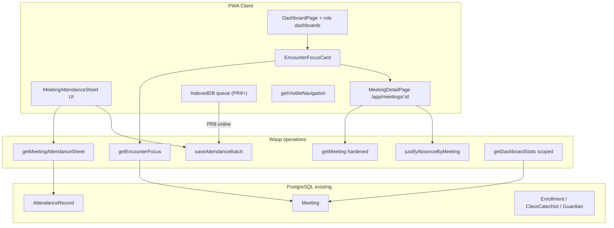
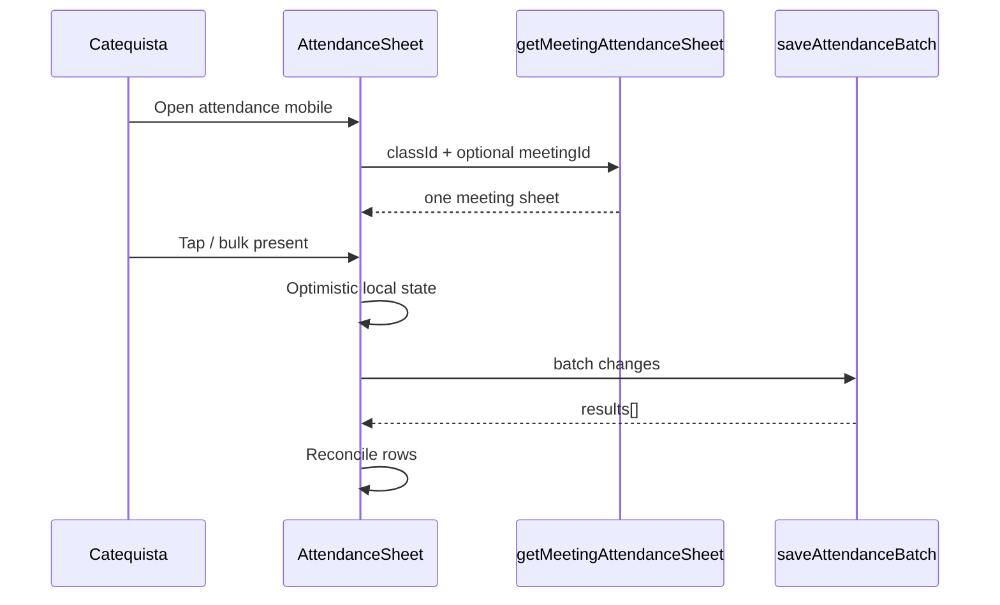

# Design Document: Encounter-Centered Mobile PWA (Catequese Viva)

| Field | Value |
|-------|--------|
| **Title** | Encontro no centro — PWA mobile por perfil |
| **Author** | Engineering (placeholder) |
| **Date** | 2026-07-15 |
| **Revised** | 2026-07-15 (post design review) |
| **Status** | Draft |
| **Scope** | Web responsive / PWA only (`app/`); Flutter **out of scope** |
| **Schema** | No Prisma migration — reuse `Meeting`, `AttendanceRecord`, `MeetingStatus`, `AttendanceStatus` |
| **Related WIP** | Zoom/viewport a11y (`tests/e2e/a11y-viewport.spec.ts`), Bottom “Mais” sheet (`BottomNav` + `BottomSheetNav`), safe-area padding in shells |

---

## Overview

Catequese Viva already models the pastoral unit of work as a **Meeting** (`schema.prisma` → `Meeting` with `MeetingStatus`: `NOT_STARTED | IN_PROGRESS | COMPLETED | CANCELLED`) and records presence via `AttendanceRecord` (`PRESENT | ABSENT | LATE | JUSTIFIED`). The product pain is not missing entities; it is **presentation and scoping**: mobile surfaces still behave like admin desktop (attendance **matrix** on small screens, parish-wide “upcoming meetings” for family roles, dense multi-CTA headers, family shell redirecting away from detail routes).

This design reorganizes the authenticated PWA around a single question answered on first paint:

> **Qual é o encontro relevante agora e o que eu preciso fazer?**

The same object — **encontro** — is shown with role-specific actions for **catequista**, **catequizando**, and **família (responsável)**. Desktop keeps dense matrices, institutional dashboards, and admin controls. Implementation reuses Wasp operations patterns under `app/src/server/operations/`, navigation centralization in `app/src/shared/navigation.ts`, and shells `AppShell` / `FamilyAppShell`.

---

## Background & Motivation

### Current state (code-grounded)

| Area | Current behavior | File(s) |
|------|------------------|---------|
| Dashboard routing | Role map → `GuardianDashboard` / `CatechumenDashboard` / default `CoordinatorDashboard` | `app/src/catequese/pages/DashboardPage.tsx` |
| Upcoming meetings | Phase-2 `upcomingMeetingsPromise` uses parish-level `class: whereClause` (L89–97) **before** `myClassIds` is resolved — so pure catechist, guardian, and catechumen all get parish-wide upcoming. | `dashboardOperations.ts` |
| Today meetings | Catechist: `myClassIds`. Coordinator+: parish. Guardian: household class IDs. **Catechumen falls through to `Promise.resolve([])`** (L235–236) — empty today + parish-wide upcoming. | same, L198–237 |
| Attendance mobile | `AttendancePage` uses `getClassAttendanceMatrix` and on `md:hidden` stacks **every meeting under every catechumen** | `AttendancePage.tsx` L132–135, L640–714 |
| Attendance save | Per-student `saveAttendance`; bulk = N parallel calls | `meetingOperations.ts` L175–210; AttendancePage L291–300 |
| Justify absence | `justifyAbsence({ attendanceId, note })` requires an **existing** row; does not upsert | `meetingOperations.ts` L213–239 |
| Meeting detail route | **No** `/app/meetings/:id` in `main.wasp` | `main.wasp` ~L711–715 |
| `getMeeting` | Full `content: true`, **no** `assertUserBelongsToClass` (unlike `deleteMeeting` / `saveAttendance`) | `meetingOperations.ts` L287–301 |
| Family shell | Allowlist: `/app`, `/app/calendar`, `/app/messages/*` only | `FamilyAppShell.tsx` L24–32 |
| Family dashboard links | Dependents → `/app/catechumens/${id}`; list → `/app/catechumens`; catechumen → `/app/documents`, journeys | `GuardianDashboard.tsx`, `CatechumenDashboard.tsx` |
| Documents | Nested `AppShell` on loading; `listDocuments` already scopes GUARDIAN/CATECHUMEN; page still calls `listCatechumens({ take: 200 })` | `DocumentsPage.tsx`; `documentOperations.ts` L99–122 |
| Nav | `BOTTOM_NAV_KEYS` = dashboard, classes, catechumens, calendar; `BottomNav` `ICON_MAP` lacks `messages` | `navigation.ts`, `BottomNav.tsx` |
| Messages | List poll 30s; chat full reload 15s; reply hover-only | `MessagesPage.tsx`, `ChatView.tsx` |
| Offline attendance | No IndexedDB; SW for push/PWA only | `App.tsx`, `pushNotifications.ts` |

### Pain points

1. **AuthZ leak (Critical):** Parish-wide `upcomingMeetings` for guardian/catechumen; catechist-only also polluted (Phase-2 ordering). Catechumen also has **empty** `todayMeetings`.
2. **Operational friction (High):** Mobile call sheet is historical matrix-shaped.
3. **Broken family deep links (High):** Cards point to routes the shell bounces (`/app/catechumens/*` not on allowlist).
4. **Justify incompleteness (High):** Existing `justifyAbsence` needs `attendanceId`; no row if catechist never marked.
5. **Touch/a11y gaps (Medium):** Hover-only reply; ClassDetail multi-button chrome.
6. **Perf / offline (Medium):** Full chat refresh; no attendance offline queue; matrix download for single-meeting work.

---

## Goals & Non-Goals

### Goals

1. **Encounter-first home** via shared `EncounterFocusCard` above metrics for catechist / catechumen / guardian.
2. **Scoped server queries** so family and catechumen never receive other classes’ meetings; catechist-only scoped to `myClassIds` for **both** today and upcoming.
3. **Single-meeting mobile attendance sheet** with auto-select, sticky header, bulk present + exceptions, optimistic save; history secondary.
4. **Authenticated meeting detail** at `/app/meetings/:id` with **concrete role-shaped DTO**; FamilyAppShell allowlist; family justify upsert.
5. **Central nav finish:** staff bottom `Início | Turmas | Agenda | Mensagens | Mais`; family lean set; remove dead hamburger drawer.
6. **Messages / calendar / forms polish:** visible reply, incremental poll, agenda default &lt;768px, Sheet calendar panel, sticky form actions, `capture="environment"`, fix Documents double shell.
7. **PWA resilience (after online sheet ships):** IndexedDB attendance queue; meeting cache stamp; draft-not-sent messages; lazy heavy admin.
8. **Desktop preserved:** matrix, institutional dashboard, multi-CTA density on `lg+`.

### Non-Goals

- Flutter / native apps (existing `api mobile*` may later call the same ops; not a deliverable).
- New Prisma models or enums.
- Redesigning landing / billing / institutional charts.
- Real-time WebSocket or SSE chat for MVP (HTTP `since` poll).
- Parish-timezone DB field (follow-up).
- Route-level i18n bundle split as MVP acceptance (strings still added to existing namespaces; split deferred).

---

## Key Decisions

| # | Decision | Rationale |
|---|----------|-----------|
| K1 | **No DB migration** | `Meeting.status`, unique `(meetingId, catechumenProfileId)`, content link cover lifecycle. |
| K2 | **New Wasp ops for focus + sheet + batch + family justify upsert**; keep matrix + single `saveAttendance` for desktop | Mobile stops calling matrix; desktop unbroken. |
| K3 | **Derive focus meeting server-side** `IN_PROGRESS → today → next → most recent` using injectable `now` | Testable; authz class set server-side. |
| K4 | **FamilyAppShell allowlist:** `/app`, calendar, messages, `/app/meetings/:id`, `/app/documents` (exact + optional query), `/app/consents` | No `/app/catechumens/*`, no class attendance matrix. |
| K5 | **Harden `getMeeting` with assert + explicit role DTO** | Closes IDOR; prevents roster/content leaks. |
| K6 | **Attendance sync authority: wall-clock LWW with server apply when `clientUpdatedAt >= record.updatedAt` (or no row); else conflict** | Single rule for online batch and offline queue; resolves prior contradiction. See §2. |
| K7 | **Desktop `md+` matrix; mobile sheet; queries gated by breakpoint** | Never fetch matrix on small screens. |
| K8 | **Nav single source `getVisibleNavigation`** | Change `BOTTOM_NAV_KEYS` + `ICON_MAP`. |
| K9 | **PR4 = online batch only; PR8 = durable IndexedDB** | Clear intermediate dual-path. |
| K10 | **Flutter out of scope** | PWA is product surface. |
| K11 | **“Today” = same calendar-day boundary as current `getDashboardStats` (server `Date` midnight)** | Matches production behavior; parish TZ follow-up. |
| K12 | **Content for learners:** expose linked `ContentItem` only if `status === 'PUBLISHED'` (staff always see linked content when class-authorized) | Closes materials policy without new fields. |
| K13 | **Coordinator multi-class focus:** single next meeting by `date` asc across scoped classes (prefer `IN_PROGRESS` first); no carousel MVP | Closes OQ#3. |
| K14 | **Guardian default `dependentId`:** first household dependent with active enrollment (stable sort by `firstName`); client may switch | Predictable empty/focus. |
| K15 | **Merge gate:** no production deploy of MeetingDetail/Focus that surfaces meeting lists without PR1 scoping | Security before UX. |
| K16 | **Single IndexedDB** `catequese-viva-offline` v1 introduced in PR6 (`db.ts` + all three stores); PR8 only adds attendance/meeting consumers | Avoid dual DBs / forced v2 migration thrash. |
| K17 | **`getMeetingAttendanceSheet` is staff-only** (`isCatechistOrAbove` + class assert) | `assertUserBelongsToClass` alone would leak full roster to GUARDIAN/CATECHUMEN. |

---

## Proposed Design

### Architecture (high level)



### 1. Encounter focus (home)

#### Timezone / “today” (K11)

- **MVP:** `startOfDay` / `endOfDay` computed exactly as today’s `getDashboardStats` (server `new Date()` then `setHours(0,0,0,0)` in Node process TZ).
- Pure `pickFocusMeeting(meetings, now: Date)` always receives injectable `now` for unit tests.
- **Follow-up (not blocking):** parish-local TZ field.

#### Selection algorithm (server)

```ts
function pickFocusMeeting(meetings: MeetingLite[], now: Date): { meeting; focusKind } | null {
  const active = meetings.filter(m => m.status !== 'CANCELLED');
  if (!active.length) return null;
  const inProgress = active.filter(m => m.status === 'IN_PROGRESS')
    .sort((a,b) => +a.date - +b.date);
  if (inProgress[0]) return { meeting: inProgress[0], focusKind: 'in_progress' };
  const start = startOfDay(now), end = endOfDay(now);
  const today = active.filter(m => m.date >= start && m.date <= end).sort((a,b) => +a.date - +b.date);
  if (today[0]) return { meeting: today[0], focusKind: 'today' };
  const upcoming = active.filter(m => m.date > end).sort((a,b) => +a.date - +b.date);
  if (upcoming[0]) return { meeting: upcoming[0], focusKind: 'upcoming' };
  const recent = active.filter(m => m.date < start).sort((a,b) => +b.date - +a.date);
  if (recent[0]) return { meeting: recent[0], focusKind: 'recent' };
  return null;
}
```

#### Class ID scope by profile

| Profile | Class ID set |
|---------|----------------|
| Catechist-only (`isCatechistOnly` + class links) | `ClassCatechist.userId` |
| Coordinator+ / admin | Workspace parish (existing `whereClause`) |
| Guardian | Enrollments of household dependents; if `dependentId` set, only that profile’s enrollments (must belong to household) |
| Catechumen | `ClassEnrollment` where `catechumenProfile.userId === context.user.id`, `status: ENROLLED` |

#### Primary CTA decision table

| Role | Conditions | `primaryCta.action` | `href` |
|------|------------|---------------------|--------|
| Staff | `meeting == null` | `NONE` | `/app/calendar` or `/app/classes` |
| Staff | `focusKind` in today/upcoming/in_progress, `status === NOT_STARTED`, no content | `PREPARE` | `/app/meetings/:id` (roteiro tab) |
| Staff | `NOT_STARTED`, has content | `START` | same; client calls status → `IN_PROGRESS` then optional sheet |
| Staff | `IN_PROGRESS`, `registered < total` | `CONTINUE_ATTENDANCE` | `/app/classes/:classId/attendance?meetingId=:id` |
| Staff | `IN_PROGRESS`, all registered | `COMPLETE` | `/app/meetings/:id` (complete action) |
| Staff | `COMPLETED` / `recent` | `VIEW` | `/app/meetings/:id` |
| Staff | `CANCELLED` only | `NONE` | calendar |
| Catechumen | any meeting | `VIEW` | `/app/meetings/:id` |
| Guardian | meeting + dependent, after start, `myStatus` null or `ABSENT` | `JUSTIFY` | `/app/meetings/:id?dependentId=&action=justify` |
| Guardian | else with meeting | `VIEW` | `/app/meetings/:id?dependentId=` |
| Guardian | no meeting | `NONE` | `/app/calendar` |

**Secondary actions (staff):** roteiro, avisar famílias (`messages` or announcement), ver turma `/app/classes/:id` — overflow menu, not primary row.

**Guardian multi-dependent:** chips above card; default first enrolled by `firstName` (K14). Changing chip refetches `getEncounterFocus({ dependentId })`.

**Coordinator multi-class (K13):** one card — earliest qualifying meeting across all scoped class IDs (not per-class carousel).

#### `getEncounterFocus` types

```ts
// app/src/shared/encounter.ts
export type EncounterFocusArgs = {
  workspaceId?: string;
  dependentId?: string; // guardian only; validated against household
};

export type EncounterFocus = {
  meeting: null | {
    id: string;
    title: string | null;
    theme: string | null;
    date: string;
    status: MeetingStatus;
    kind: MeetingKind;
    class: { id: string; name: string };
    locationHint: string | null; // class.community?.name or class.name fallback
  };
  focusKind: 'in_progress' | 'today' | 'upcoming' | 'recent' | 'none';
  preparation?: { hasContent: boolean; contentId: string | null; contentTitle: string | null }; // staff only
  attendanceSummary?: {
    registered: number;
    totalActive: number;
    myStatus?: AttendanceStatus | null; // learner: self or selected dependent
  };
  dependents?: Array<{ id: string; firstName: string; lastName: string }>; // guardian
  dependent?: { id: string; firstName: string; lastName: string } | null;
  primaryCta: {
    action: 'PREPARE' | 'START' | 'CONTINUE_ATTENDANCE' | 'COMPLETE' | 'VIEW' | 'JUSTIFY' | 'NONE';
    href: string;
    labelKey: string; // e.g. encounter.cta.continue_attendance
  };
  secondaryActions: Array<{ id: string; labelKey: string; href: string }>;
  materialsReleased?: Array<{ id: string; title: string }>; // PUBLISHED content only
  notices: Array<{ id: string; textKey?: string; text?: string }>;
  fetchedAt: string;
};
```

#### Critical bug fix in `getDashboardStats` (PR1 — full scope)

**Implementation notes (Phase reordering):**

1. Resolve **role class scopes early** (before or as part of Phase-2):
   - `myClassIds` from `ClassCatechist` (already queried — move ahead of meeting lists or compute household/catechumen sets in parallel first).
   - `householdClassIds` for pure GUARDIAN.
   - `catechumenClassIds` for pure CATECHUMEN via enrollments on `userId`.
2. Build `meetingClassFilter`:
   - admin: none
   - catechist-only: `{ classId: { in: myClassIds } }` (empty → no meetings)
   - guardian: household classes
   - catechumen: own enrollments
   - coordinator+: existing `class: whereClause`
3. Apply **same filter** to:
   - `upcomingMeetingsPromise` (currently parish-wide for everyone non-admin)
   - `todayMeetingsPromise` (add **CATECHUMEN branch** — today empty is a product bug)
4. **`mobileDashboard`** in `server/api/mobile.ts` calls `getDashboardStats` — **yes, fixed automatically**; add a note in PR1 description; optional thin integration assert that mobile path uses same op (no duplicate logic).

**Regression tests (PR1, not deferred to e2e-only):**

- GUARDIAN: zero foreign `classId` in `upcomingMeetings` and `todayMeetings`.
- CATECHUMEN: same; and todayMeetings non-empty when seed has today’s meeting in enrolled class.
- Catechist-only: upcoming ⊆ `myClassIds`.
- Coordinator: may still see parish (by design).

---

### 2. Mobile attendance sheet

#### Problem

Mobile still loads full matrix (`getClassAttendanceMatrix`) and nests meetings under students (`AttendancePage` L640–714).

#### Authority model for batch + offline (K6) — single rule

**Algorithm (server, per change in `changes[]` order):**

```
Input: meetingId, changes[{ catechumenProfileId, status, note?, clientUpdatedAt }]
Preconditions:
  - auth: isCatechistOrAbove + assertUserBelongsToClass
  - meeting exists; if meeting.status === CANCELLED → 400 entire batch
  - COMPLETED meetings: allow corrections (pastoral reality) unless product later freezes
  - 1 <= changes.length <= 100 else 400
  - status ∈ AttendanceStatus enum else skip with reason invalid_status
  - note length <= 500 chars else skip invalid_note

For each change (best-effort per-row, not all-or-nothing transaction):
  1. If not ENROLLED in meeting.classId → skip unenrolled
  2. Load existing AttendanceRecord by unique pair
  3. If existing && clientUpdatedAt < existing.updatedAt → conflict (skip apply)
     Compare ISO timestamps as Date; if client clock skew makes clientUpdatedAt > server now + 5min, clamp to server now when applying
  4. Else upsert status/note/recordedById = user.id (same as saveAttendance)
  5. Mark applied

Return:
{
  serverTime: ISO,
  results: Array<{
    catechumenProfileId: string;
    outcome: 'applied' | 'conflict' | 'skipped';
    reason?: 'unenrolled' | 'invalid_status' | 'invalid_note' | 'stale_client' | string;
    status: AttendanceStatus | null;      // final server status
    updatedAt: string | null;
    serverStatus?: AttendanceStatus;      // when conflict: current server value
    serverUpdatedAt?: string;
  }>
}
```

**Client interpretation:**

- **PR4 (online):** optimistic UI; on response, reconcile each row to `status`/`outcome`; toast partial failures; no durable IDB.
- **PR8 (offline):** IDB key `${meetingId}:${catechumenProfileId}` stores latest pending change only (LWW in queue). On sync, send batch; **clear IDB only for `outcome === 'applied'`**; keep conflicts for user resolve (show sheet row with server vs local; default button “Usar minha marcação” resubmits with `clientUpdatedAt = serverTime + 1ms` or “Manter servidor”).
- **Two catechists offline:** wall-clock LWW on reconnect; last applied wins; conflicts surface when the other device’s `updatedAt` is newer. No device id required for MVP.
- **Open Question #5 closed** by K6.

Idempotency: re-sending the same `(pair, status, clientUpdatedAt)` after apply is no-op success (`applied` or already equal).

#### Online sequence (PR4)



#### Query gating (K7 / Issue 13)

```ts
// AttendancePage conceptual
const isMobileSheet = useMediaQuery('(max-width: 767px)'); // or match Tailwind md
const sheetQuery = useQuery(getMeetingAttendanceSheet, args, { enabled: isMobileSheet && !!classId });
const matrixQuery = useQuery(getClassAttendanceMatrix, { classId }, { enabled: !isMobileSheet && !!classId });
// Never enable both. History Sheet may enable matrix only when user opens "Histórico".
```

Unit/integration: assert sheet path does not invoke matrix op (mock).

#### `getMeetingAttendanceSheet`

**AuthZ (mandatory — staff roster only):**

```ts
// Pseudocode — mirror saveAttendance, NOT matrix-only assert
if (!context.user) throw new HttpError(401);
const role = await getUserRole(context);
if (!isCatechistOrAbove(role)) {
  throw new HttpError(403, 'Apenas catequistas e coordenadores podem ver a folha de chamada.');
}
// Then resolve meeting / classId and:
await assertUserBelongsToClass(context, classId);
```

- **Do not** authorize sheet access via `assertUserBelongsToClass` alone. That helper intentionally allows GUARDIAN/CATECHUMEN for their enrolled classes (`meetingOperations.ts` L58–86); a full `participants[]` roster must never be returned to those roles.
- Pure GUARDIAN / CATECHUMEN → **403** even if they pass class membership.
- Family presence for a dependent stays on **role-shaped `getMeeting`** / `getEncounterFocus` (own/dependent status only), never the sheet op.
- **Regression test (PR4):** guardian with enrolled dependent in class cannot call `getMeetingAttendanceSheet` (403); catechumen same; lead catechist of class OK; catechist of other class 403 via assert.
- **Pre-existing debt (optional same PR):** `getClassAttendanceMatrix` today is assert-only — harden with `isCatechistOrAbove` in PR4 if cheap, else track as follow-up (same leak pattern).

```ts
type GetSheetArgs = { meetingId?: string; classId: string };

type MeetingAttendanceSheet = {
  meeting: { id: string; title: string | null; date: string; status: MeetingStatus; class: { id: string; name: string } };
  participants: Array<{
    catechumenProfileId: string;
    firstName: string;
    lastName: string;
    photoUrl: string | null;
    enrollmentStatus: string;
    attendanceId: string | null;
    status: AttendanceStatus | null;
    note: string | null;
    updatedAt: string | null;
  }>;
  summary: { registered: number; total: number; present: number; absent: number; late: number; justified: number };
  siblingMeetings: Array<{ id: string; date: string; title: string | null; status: MeetingStatus }>; // labels only, max ~40 recent+upcoming
  fetchedAt: string;
};
```

Auto-select meeting if `meetingId` omitted: same priority as focus among class siblings.

#### UI structure

| Piece | Behavior |
|-------|----------|
| Sticky header | Turma, data, `18 de 22 registrados`, switcher Sheet |
| List | One person/row, 44×44 status |
| Bulk | ConfirmDialog then one batch of PRESENT for unset or all |
| Sync chip PR4 | Salvando / Salvo / Erro |
| Sync chip PR8 | + Pendente de sincronização |
| History | Secondary; enables matrix query on demand |

Files: `MeetingAttendanceSheet.tsx`; `useAttendanceSave.ts` (online); PR8 adds `useAttendanceOfflineQueue.ts`.

---

### 3. Navigation & chrome

#### Bottom bar

| Role group | Destinations |
|------------|--------------|
| Staff | Início, Turmas, Agenda, Mensagens, **Mais** |
| Family shell | Início, Agenda, Mensagens (unchanged lean; product goal) |

```ts
export const BOTTOM_NAV_KEYS = ['dashboard', 'classes', 'calendar', 'messages'] as const;
// BottomNav ICON_MAP must add messages: MessageSquareText (currently missing)
```

#### AppShell

Remove dead `mobileMenuOpen` drawer when bottom bar present; keep safe-area padding; prefer `100dvh` on shell root.

#### FamilyAppShell — reachable routes after expansion

| Path | Purpose | Link sources to update |
|------|---------|------------------------|
| `/app` | Home + focus | bottom nav |
| `/app/calendar` | Agenda | bottom nav; focus empty CTA |
| `/app/messages`, `/app/messages?*` | Chat | bottom nav |
| `/app/meetings/:id` | Detail + justify | focus card, calendar item click |
| `/app/documents` | Family docs | focus secondary / catechumen CTA |
| `/app/consents` | LGPD self-service | settings/more if shown |

**Explicitly NOT allowed:** `/app/catechumens`, `/app/catechumens/:id`, `/app/classes/*`, `/app/classes/:id/attendance` (staff call sheet).

**Calendar clicks:** must navigate to `/app/meetings/:id` (not class meetings route). Update `CalendarPage` event handlers for family roles / family host.

**Documents on family host:**

- Server: `listDocuments` already scopes GUARDIAN/CATECHUMEN (`documentOperations.ts`).
- UX: family should not depend on staff-wide `listCatechumens({ take: 200 })` UI. PR7: when role is GUARDIAN/CATECHUMEN, render household/self document list only (reuse scoped list; for upload pick dependents from `getDashboardStats.dependents` or a small household query already available). Remove nested `AppShell`. Nested shell fix applies to all roles.

**Consents:** keep allowlisted — GUARDIAN already has consents in nav roles.

---

### 4. Meeting detail by profile

#### Route

```wasp
route AppMeetingDetailRoute { path: "/app/meetings/:id", to: AppMeetingDetailPage }
page AppMeetingDetailPage {
  authRequired: true,
  component: import MeetingDetailPage from "@src/catequese/pages/MeetingDetailPage"
}
```

#### `getMeeting` hardened — concrete DTO

```ts
// After load + assertUserBelongsToClass(context, meeting.classId):

type MeetingDetailDTO = {
  id: string;
  title: string | null;
  theme: string | null;
  date: string;
  status: MeetingStatus;
  kind: MeetingKind;
  notes: string | null; // staff: full; learner: sanitized or null if internal-only — MVP: staff full, learner null unless PUBLISHED content covers guidance
  details: string | null; // same policy as notes
  class: { id: string; name: string; ageGroup: string | null };
  locationHint: string | null;
  content: null | {
    id: string;
    title: string;
    theme: string | null;
    // staff: full pedagogical fields from ContentItem
    // learner: only if content.status === 'PUBLISHED': title, theme, mainContent, materials, openingPrayer, closingPrayer, activity (no draft/review fields)
    status?: ContentStatus; // staff only
    // ...field subsets by role
  };
  // staff only:
  attendanceSummary?: { registered: number; totalActive: number };
  // never for learner:
  // full roster omitted

  // catechumen:
  myAttendance?: { id: string | null; status: AttendanceStatus | null; note: string | null };

  // guardian:
  dependentsOnMeeting?: Array<{
    catechumenProfileId: string;
    firstName: string;
    lastName: string;
    attendanceId: string | null;
    status: AttendanceStatus | null;
    note: string | null;
  }>; // only household members enrolled in this class

  permissions: {
    canEdit: boolean;
    canTakeAttendance: boolean;
    canChangeStatus: boolean;
    canJustify: boolean;
  };
  fetchedAt: string;
};
```

**Tests:** guardian IDOR other class → 403; catechumen no roster keys; staff OK; unpublished content null for learner.

#### Status transitions (server-enforced in `updateMeeting`)

| Action | From | To | Who (`isCatechistOrAbove` + class assert) |
|--------|------|-----|-------------------------------------------|
| START | `NOT_STARTED` | `IN_PROGRESS` | Catechist+ |
| COMPLETE | `IN_PROGRESS` | `COMPLETED` | Catechist+ |
| CANCEL | `NOT_STARTED` or `IN_PROGRESS` | `CANCELLED` | Catechist+ (coordinator same) |
| REOPEN (optional MVP skip) | `COMPLETED` | `IN_PROGRESS` | Coordinator+ only if needed later |

Invalid transitions → `400`. Other field updates (title, theme, contentId) unchanged parish checks.

#### Family justify flow (Issue 2)

**Problem:** `justifyAbsence({ attendanceId, note })` cannot run if no row exists.

**Solution (no schema change):** add action `justifyAbsenceByMeeting`:

```ts
// args
{ meetingId: string; catechumenProfileId: string; note: string }

// auth
// 1. requireAuth
// 2. guardian household owns catechumenProfileId (same as justifyAbsence) OR admin
// 3. assert enrollment in meeting.classId (ENROLLED)
// 4. assertUserBelongsToClass via meeting (guardian path already in assert)

// behavior
// - note required, 3..500 chars
// - meeting CANCELLED → 400
// - if NOT_STARTED and date is still in future: allow pre-justification (upsert JUSTIFIED) — pastoral excuse ahead of time
// - upsert AttendanceRecord JUSTIFIED + note (create if missing, update if exists)
// - keep justifyAbsence(attendanceId) for backward compatibility
```

**UI (MeetingDetail, family):**

- List dependents on meeting with status chips.
- If status null / ABSENT / LATE → show “Justificar falta” (primary or secondary).
- Form: note textarea + submit → `justifyAbsenceByMeeting`.
- If already JUSTIFIED → show note read-only + optional edit (same action).
- If PRESENT → no justify CTA (or “falar com catequese” via messages).

**Deep link:** `/app/meetings/:id?dependentId=&action=justify` scrolls/opens justify sheet.

---

### 5. Messages, calendar, forms

#### Messages — `since` semantics (Issue 10)

```ts
// getConversation args extension
{ conversationId: string; cursor?: string; since?: string; take?: number }

// Rules:
// - If `since` present: IGNORE cursor. messageWhere.createdAt = { gt: new Date(since) }; orderBy createdAt asc; take max 100.
// - If only cursor: existing behavior (createdAt lt, desc) for older history.
// - If neither: latest page (existing).
// - MVP: does NOT return soft-deleted or reaction-only diffs; deletedAt filter stays deletedAt: null.
// - Edits: Message model has no separate edit trail in MVP — out of scope; document follow-up `updatedAt > since` if edits added later.
// - Client poll: since = last received message createdAt (max); merge by id.
```

**Drafts:** **IndexedDB only** (not sessionStorage), max content 4k chars, purge on successful send. Offline: show “Pendente” / not “Enviada”.

**Shared offline DB ownership (K16 — avoid dual IDB thrash):**

| PR | Owns | What lands |
|----|------|------------|
| **PR6** | Introduces `app/src/client/offline/db.ts` | OpenDB wrapper for DB name `catequese-viva-offline`, **version 1**, creates object stores `messageDrafts`, `attendanceQueue`, `meetingCache` (attendance/meeting stores may be empty until PR8). Draft helpers read/write `messageDrafts` only. |
| **PR8** | Consumers of attendance/meeting stores | No second DB name; **no schema version bump** unless new indexes required. Implements enqueue/sync for `attendanceQueue` + `meetingCache` stamp; leaves draft API untouched. |

Do **not** invent a separate IDB database in PR6. Do **not** soft-block PR6 on PR8 — drafts ship with the shared v1 shell.

**Reply:** always-visible touch target (`min-h-11`); `md:` may keep subtle hover styling but never opacity-0 only.

#### Calendar

- &lt;768: agenda list default; month alternate.
- Mobile panel → Radix `Sheet`.
- Event navigation → `/app/meetings/:id` for all roles that can open detail; staff may also deep-link attendance.

#### Forms / documents

- Sticky primary above bottom nav.
- `capture="environment"` on photo/doc file inputs.
- Documents: remove nested AppShell; family-safe list UX (see §3).

---

### 6. PWA, offline, performance

#### IndexedDB (shared v1 — PR6 shell, PR8 attendance)

```ts
// app/src/client/offline/db.ts (introduced in PR6 — see K16 / §5)
// DB name: catequese-viva-offline, version: 1
// upgrade: createObjectStore messageDrafts, attendanceQueue, meetingCache
// messageDrafts keyPath: conversationId → { content, updatedAt }
// attendanceQueue keyPath: id = `${meetingId}:${catechumenProfileId}`
// meetingCache keyPath: meetingId → { payload, fetchedAt }
// Version bumps require migrate handler in openDB wrapper (PR8+ only if needed)

// Debug: localStorage.DEBUG_OFFLINE=1 → console table of queue length
// Support: no server tooling MVP; queue length logged on sync failure
```

**Service worker:** existing `public/sw.js` / registration must **not** cache Wasp operation POST/mutation responses. Document: audit SW fetch handler; if network-first for `/operations` or API, keep it; never stale-while-revalidate attendance writes.

#### Perf budgets

| Metric | Target | MVP measurement |
|--------|--------|-----------------|
| LCP | ≤2.5s | **Manual** Lighthouse on seeded catechist home + attendance sheet before release |
| CLS | ≤0.1 | Manual |
| INP | ≤200ms p75 | Manual |
| Payload | No matrix on mobile sheet | Automated test (query enabled flags) |

**CI Lighthouse for authenticated `/app` is optional follow-up** — not a merge gate. Primary acceptance: no historical matrix download on mobile sheet path.

#### i18n (Issue 11)

Bundle split **out of MVP acceptance**. Every PR that adds UI:

| PR | Namespace | Example keys |
|----|-----------|--------------|
| PR2 | `meetings`, `common` | `meetings.detail.justify`, `meetings.status.in_progress`, `meetings.cta.start` |
| PR3 | `dashboard`, `meetings` | `encounter.focus.title`, `encounter.cta.prepare`, `encounter.empty`, `encounter.dependent_label` |
| PR4 | `attendance` | `attendance.sheet.mark_all_present`, `attendance.sheet.progress`, `attendance.sheet.saved`, `attendance.sheet.saving`, `attendance.sheet.sync_error` |
| PR6 | `messages` | `messages.reply`, `messages.draft_pending`, `messages.send_failed` |
| PR8 | `attendance` | `attendance.sheet.pending_sync`, `attendance.sheet.conflict_use_mine`, `attendance.sheet.data_updated_at` |

Require `npm run i18n:check` green on each such PR (pt-BR / en / es parity).

#### Code-splitting / motion

Lazy reports/charts when those routes load; `prefers-reduced-motion` disables non-essential animate-in on attendance taps. Defer i18n route split spike (was PR9) to backlog.

---

## API / Interface Changes

### New (`main.wasp`)

| Kind | Name | Purpose |
|------|------|---------|
| query | `getEncounterFocus` | Role-scoped focus + CTAs |
| query | `getMeetingAttendanceSheet` | One meeting roster + summary (**staff only**) |
| action | `saveAttendanceBatch` | Per-row LWW batch (max 100) |
| action | `justifyAbsenceByMeeting` | Guardian upsert JUSTIFIED |
| route/page | `AppMeetingDetailRoute` | `/app/meetings/:id` |

#### Required `entities` lists (Wasp — every Prisma model touched)

Per `app/AGENTS.md`: missing entities cause runtime errors. Register as follows (adjust only if implementation omits a join):

```wasp
query getEncounterFocus {
  fn: import { getEncounterFocus } from "@src/server/operations/encounterOperations",
  entities: [
    Meeting, AttendanceRecord, CatechesisClass, ClassEnrollment, ClassCatechist,
    Membership, Parish, GuardianProfile, CatechumenProfile, ContentItem,
    Household, Community, User
  ]
}

query getMeetingAttendanceSheet {
  fn: import { getMeetingAttendanceSheet } from "@src/server/operations/meetingOperations",
  entities: [
    Meeting, AttendanceRecord, CatechumenProfile, CatechesisClass, ClassEnrollment,
    Membership, Parish, ClassCatechist, User
  ]
}

action saveAttendanceBatch {
  fn: import { saveAttendanceBatch } from "@src/server/operations/meetingOperations",
  entities: [
    AttendanceRecord, Membership, Meeting, CatechesisClass, ClassEnrollment,
    CatechumenProfile, Parish, ClassCatechist, User
  ]
}

action justifyAbsenceByMeeting {
  fn: import { justifyAbsenceByMeeting } from "@src/server/operations/meetingOperations",
  entities: [
    AttendanceRecord, Membership, Meeting, CatechesisClass, ClassEnrollment,
    GuardianProfile, CatechumenProfile, Household, Parish, User
  ]
}
```

**Entity rationale (quick):**

| Op | Why extra models |
|----|------------------|
| `getEncounterFocus` | `ClassCatechist` / enrollments for scope; `GuardianProfile`+`Household`+`CatechumenProfile` for dependents; `ContentItem` for prepare/materials; `Community` for `locationHint` via class; `Membership`/`Parish` for workspace |
| `getMeetingAttendanceSheet` | Roster = enrollments + profiles + attendance; `Membership`+role path same as `saveAttendance`; no Guardian entities (staff-only) |
| `saveAttendanceBatch` | Same as `saveAttendance` plus profile if returned in results |
| `justifyAbsenceByMeeting` | Same household checks as `justifyAbsence` + `Meeting`/`ClassEnrollment` for upsert path |

Also expand **`getMeeting`** entities when hardening (today: `[Meeting, ContentItem, CatechesisClass]`):

```wasp
// getMeeting — after PR2 shape/assert
entities: [
  Meeting, ContentItem, CatechesisClass, Membership, Parish,
  ClassCatechist, ClassEnrollment, AttendanceRecord,
  GuardianProfile, CatechumenProfile, Household, Community, User
]
```

### Modified

| Op | Change |
|----|--------|
| `getDashboardStats` | Scope upcoming **and** today for GUARDIAN, CATECHUMEN, catechist-only; reorder phase for `myClassIds` |
| `getMeeting` | `isCatechistOrAbove` not required for read; **must** `assertUserBelongsToClass` + role DTO (learners allowed shaped payload) |
| `updateMeeting` | status transition matrix; entities already include content/class — add any missing if transition loads membership |
| `getConversation` | `since` exclusive lower bound |

### Unchanged

- `getClassAttendanceMatrix` (optional PR4 harden with `isCatechistOrAbove`), `saveAttendance`, `justifyAbsence(attendanceId)` (compat), desktop matrix UI

### Shared types

`app/src/shared/encounter.ts` — `EncounterFocus*`, `MeetingAttendanceSheet`, `PendingAttendanceChange`, batch result types.

---

## Data Model Changes

**None.** Optional future: `Meeting.location`, parish TZ — out of scope.

---

## Alternatives Considered

### A. Fix only `getDashboardStats` scoping; keep matrix mobile UI

- **Pros:** Smallest PR; closes leak.
- **Cons:** Does not deliver encounter-centered UX.
- **Use as PR1 only**, not full solution.

### B. New `MeetingSession` / call-sheet tables

- **Reject** — existing models suffice; dual writes cost.

### C. Separate `/familia/...` route tree

- **Defer** — expand FamilyAppShell allowlist cheaper.

### D. WebSockets for chat/attendance

- **Reject** for MVP — HTTP poll + batch enough for class ~50.

### E. Reuse mobile HTTP API (`/mobile/meetings`) for PWA

- **Reject for PWA UI:** Wasp operations integrate with React Query, auth session, and entity declarations already used by web. Mobile API remains for native/out-of-scope clients and can later call shared functions extracted from ops — do not dual-maintain fetch shapes in the React app.

### F. Attendance-only via `/app/classes/:id/attendance?meetingId=` without `/app/meetings/:id`

- **Partial accept:** staff call sheet stays on class attendance route with `meetingId` query. **Still need** `/app/meetings/:id` for family/catechumen (FamilyAppShell must not open class attendance; content/justify/view need a permission-shaped page). Reject as sole navigation model.

### G. SSE instead of poll for chat

- **Defer:** more infra than `since` poll; revisit if pastoral scale or latency requires it.

---

## Security & Privacy Considerations

| Threat | Severity | Mitigation |
|--------|----------|------------|
| Cross-class meeting leakage | Critical | PR1 scope upcoming+today; tests both roles |
| `getMeeting` IDOR | High | assert + DTO |
| Roster leak via **sheet** query | **High** | **K17:** `isCatechistOrAbove` **and** class assert on `getMeetingAttendanceSheet`; 403 GUARDIAN/CATECHUMEN; PR4 regression test |
| Roster leak via **detail** DTO | Medium | no `participants[]` on learner `getMeeting` payload |
| Matrix assert-only (pre-existing) | Medium | optional PR4 harden `getClassAttendanceMatrix` with staff role gate |
| Unpublished content to learners | Medium | PUBLISHED only (K12) |
| Batch privilege | High | same as saveAttendance (`isCatechistOrAbove`) |
| Justify spoof other child | High | household check + enrollment |
| dependentId IDOR on focus | High | household validation |
| Offline queue tampering | Low | server re-validates enrollment |
| Documents family host | Medium | rely on listDocuments scope; avoid listCatechumens staff UI |

Nav filter is UX only — never AuthZ.

---

## Observability

| Signal | How |
|--------|-----|
| 403 on focus/meeting/stats | logger + post-deploy watch |
| Batch | log `meetingId`, `changeCount`, counts by outcome |
| Offline sync | client `attendance_sync_failed` with queueLength when `DEBUG` or always sampled |
| IDB | version in open handler; console when `localStorage.DEBUG_OFFLINE=1` |
| Chat poll errors | existing toasts |

---

## Rollout Plan

1. **Merge gates:** PR1 must land before production enablement of any feature that **lists** meetings for family (MeetingDetail can merge to main after PR1 or same release train; **do not ship detail to prod users without PR1** — K15).
2. **Feature flags (optional defaults):**
   - Homolog: focus card + sheet **on**.
   - Prod: ship PR1 immediately on; UX flags `encounterFocus`, `attendanceSheet` default on after soak on homolog 48h.
3. **Rollback:** revert UI PRs freely; **never** revert PR1 scoping.
4. **No migration** → no DB rollback.

---

## Testing & Acceptance

### Viewports / roles

Unchanged product matrix (320–768, three roles, before/during/after meeting).

### PR1 automated (required)

Unit/integration: GUARDIAN, CATECHUMEN, catechist-only foreign classId assertions; catechumen todayMeetings; note mobile uses same op.

### Explicit checks

- Authz API tests in PR1; e2e smoke later.
- Sheet path never enables matrix query on mobile.
- ≤2 taps mark presence; bulk confirm; ≥44×44; no hover-only essentials.
- Justify without pre-existing attendance row.
- Offline (PR8): mark → offline → reopen → sync; conflict UI.
- `npm run i18n:check` on string PRs.
- Lighthouse: **manual release checklist**, not CI gate.

---

## Risks

| Risk | Severity | Mitigation |
|------|----------|------------|
| Server TZ vs BR midnight | Medium | K11 + injectable now tests; parish TZ follow-up |
| Phase reorder perf | Low | Parallelize class id resolution |
| Partial batch | Medium | Per-row results + UI reconcile |
| Family documents UX | Medium | Role-branch UI PR7 |
| Matrix still fetched | High if missed | Query `enabled` split + test |
| Clock skew offline | Medium | Clamp clientUpdatedAt; conflict UI |

---

## Open Questions

1. ~~Timezone for today~~ → **Resolved K11** (server day boundary; parish TZ follow-up).
2. ~~Materials released~~ → **Resolved K12** (`PUBLISHED` only for learners).
3. ~~Coordinator multi-class~~ → **Resolved K13** (single next meeting across classes).
4. Catechumen on staff host vs family host only for focus card — current `AppShell` redirects pure family roles to family portal; focus lives on whichever host they use after redirect. No extra work unless product wants dual chrome.
5. ~~Multi-device offline LWW~~ → **Resolved K6**.
6. Meeting location: use `locationHint` from community/class name until schema field exists.
7. Feature flags soak duration — default 48h homolog (see Rollout).

---

## References

- `app/AGENTS.md`, `app/main.wasp`, `app/schema.prisma`
- `app/src/server/operations/dashboardOperations.ts` — Phase-2 upcoming parish scope; catechumen today empty
- `app/src/server/operations/meetingOperations.ts` — assert, saveAttendance, justifyAbsence, getMeeting
- `app/src/server/operations/documentOperations.ts` — GUARDIAN/CATECHUMEN document scope
- `app/src/server/api/mobile.ts` — `mobileDashboard` → `getDashboardStats`
- `app/src/shared/navigation.ts`, shells, dashboards, AttendancePage, MessagesPage, ChatView, DocumentsPage
- Tests: `family-portal`, `guardian-leak`, `navigation-access`, `a11y-viewport`

---

## PR Plan

Security first. Online sheet before offline. Dashboard links fixed early.

### PR1 — `fix(authz): scope dashboard meetings for family, catechumen, and catechist-only`

- **Files:** `dashboardOperations.ts` (reorder phase; scope upcoming + today for GUARDIAN/CATECHUMEN/catechist-only); `app/src/__tests__/*` regression (both roles + catechist); mention `mobileDashboard` inherits fix (no separate mobile code path unless duplicated logic found).
- **Dependencies:** none
- **Description:** Critical leak + catechumen empty today. **Never rollback.** Automated authz tests in this PR (not only PR10).
- **i18n:** none

### PR2 — `feat(meetings): harden getMeeting, MeetingDetailPage, family justify upsert, shell allowlist, dashboard link cleanup`

- **Files:** `main.wasp` (route, `justifyAbsenceByMeeting` + **entities**, expanded `getMeeting` entities); `meetingOperations.ts` (assert, DTO, status transitions, justify-by-meeting); `MeetingDetailPage.tsx`; `FamilyAppShell.tsx` allowlist; **`GuardianDashboard.tsx` / `CatechumenDashboard.tsx`** remove `/app/catechumens*` links — dependents open focus/meeting/calendar only; documents CTA only if `/app/documents` allowed; `CalendarPage` meeting → `/app/meetings/:id` for family; i18n `meetings/*`
- **Dependencies:** **Hard merge gate for prod with PR1** (K15). Can develop in parallel but release after PR1.
- **Description:** Role-shaped detail; justify without prior row; stop shell bounce from dashboard cards.

### PR3 — `feat(dashboard): getEncounterFocus + EncounterFocusCard`

- **Files:** `main.wasp` (query + **full entities list**); `encounterOperations.ts`; `shared/encounter.ts`; `EncounterFocusCard.tsx`; wire three dashboards; unit tests `pickFocusMeeting` + CTA table
- **Dependencies:** **Hard depends on PR2** (hrefs to `/app/meetings/:id` and attendance query); PR1 for list consistency
- **Description:** Home focus + dependent chips (K14) + coordinator single-meeting rule (K13)
- **i18n:** `encounter.*` under `dashboard` or `meetings` (pick one ns and stick)

### PR2 / PR3 / PR4 wasp registration note

Copy entity inventories from **API / Interface Changes → Required `entities` lists**. PR2 must also expand `getMeeting` entities when adding assert + guardian/content joins.

### PR4 — `feat(attendance): sheet query/batch + mobile UI (online only)`

- **Files:** `main.wasp` (sheet + batch + **entities lists**); `meetingOperations.ts` (`isCatechistOrAbove` + assert on sheet; batch); `MeetingAttendanceSheet.tsx`; `AttendancePage` breakpoint query gating; i18n `attendance.sheet.*`; tests: batch limits/conflicts/cancelled; **guardian/catechumen sheet → 403**; optional matrix staff-gate
- **Dependencies:** soft PR2 for deep links; no IDB
- **Description:** Online optimistic + `saveAttendanceBatch`; staff-only roster (K17); matrix only `md+` or history; **no durable offline**

### PR5 — `feat(nav): staff bottom bar Messages + ICON_MAP + remove dead hamburger`

- **Files:** `navigation.ts`, `BottomNav.tsx`, `AppShell.tsx`, `navigation-access.test.ts`, e2e nav-parity/a11y
- **Dependencies:** none
- **Description:** Início/Turmas/Agenda/Mensagens/Mais; family shell stays lean 3-item

### PR6 — `fix(messages): touch reply + since poll + shared offline DB shell + drafts`

- **Files:** `ChatView.tsx`, `MessagesPage.tsx`, `conversationOperations.ts` (`since`); **`app/src/client/offline/db.ts`** (K16: `catequese-viva-offline` v1 with `messageDrafts` + empty `attendanceQueue`/`meetingCache`); draft helper on `messageDrafts`
- **Dependencies:** none (does not wait on PR8)
- **Description:** `since` rules as §5; drafts via shared IDB only; establishes offline module for PR8

### PR7 — `fix(calendar,forms,documents): agenda default, Sheet, family docs UX, nested AppShell`

- **Files:** `CalendarPage.tsx`, `DocumentsPage.tsx`, form sticky bars, capture attrs
- **Dependencies:** PR2 allowlist for calendar→meeting links
- **Description:** Family-safe documents branch; remove nested AppShell

### PR8 — `feat(pwa): attendance queue + meeting cache on existing offline DB, SW mutation audit`

- **Files:** `useAttendanceOfflineQueue.ts` (and related) using **existing** `offline/db.ts` — no new DB name; integrate sheet save path; sync chip pending/conflict; SW audit; optional lazy charts if cheap
- **Dependencies:** PR4 (sheet/batch); **PR6 preferred** for `db.ts` (if PR8 merges first, it must land the same v1 `db.ts` shell — do not diverge)
- **Description:** Durable queue LWW (K6); clear only applied; DEBUG_OFFLINE; “Dados atualizados em…”
- **Note:** Former PR9 perf/i18n-split deferred to backlog; include only light `prefers-reduced-motion` + lazy reports if small

### PR9 — `test(e2e): encounter mobile acceptance`

- **Files:** Playwright specs (sheet, family detail/justify, authz negative smoke); extend a11y-viewport
- **Dependencies:** PR1–PR8 preferably; PR1 already has API tests
- **Description:** Viewports/roles; manual Lighthouse checklist in PR description

---

### Merge / release checklist

1. PR1 on main (prod) ASAP.
2. No prod MeetingDetail/Focus without PR1.
3. Homolog: PR2–PR4 soak.
4. Prod UX flags on after homolog.
5. PR8 offline after sheet stable.

---

*End of design document.*
